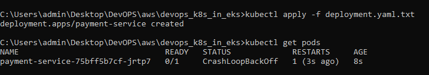
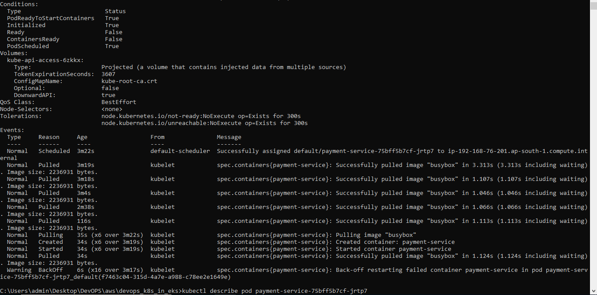
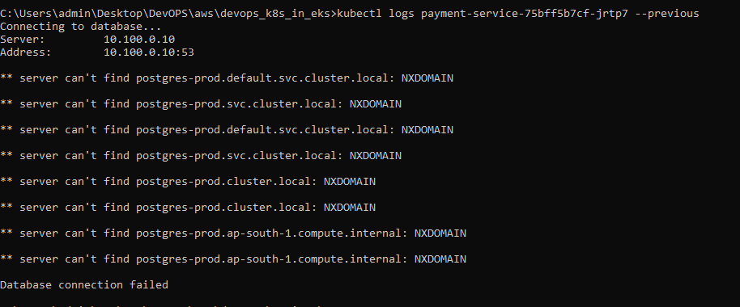
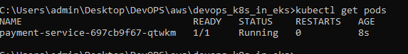

# Kubernetes Production Troubleshooting: CrashLoopBackOff

## Scenario Overview

This project demonstrates a common Kubernetes production incident where an application enters a `CrashLoopBackOff` state due to a configuration error.

The objective is to investigate the failure, identify the root cause, restore service availability, and document the incident using a production-grade troubleshooting workflow.

---

# Architecture

```text
+---------------------+
| payment-service Pod |
+----------+----------+
           |
           |
           v
      postgres-prod
      (Invalid DNS)

Application Fails
Container Exits
Kubernetes Restarts Container
CrashLoopBackOff
```

---

# Business Impact

A payment-processing microservice became unavailable after a deployment.

### Impact

* Customers unable to complete payments
* Increased transaction failures
* Potential revenue loss
* Production alerts triggered

---

# Environment

| Component  | Value           |
| ---------- | --------------- |
| Kubernetes | v1.30+          |
| Cluster    | Minikube / Kind |
| Namespace  | default         |
| Runtime    | containerd      |
| OS         | Ubuntu          |

---

# Deployment Manifest

File:

```text
manifests/crashloop-deployment.yaml
```

```yaml
apiVersion: apps/v1
kind: Deployment
metadata:
  name: payment-service
spec:
  replicas: 1
  selector:
    matchLabels:
      app: payment-service
  template:
    metadata:
      labels:
        app: payment-service
    spec:
      containers:
      - name: payment-service
        image: busybox
        env:
        - name: DB_HOST
          value: postgres-prod
        command:
        - /bin/sh
        - -c
        - |
          echo "Connecting to database..."
          nslookup $DB_HOST

          if [ $? -ne 0 ]; then
            echo "Database connection failed"
            exit 1
          fi

          sleep 3600
```

Deploy:

```bash
kubectl apply -f manifests/crashloop-deployment.yaml
```

---

# Symptoms

Check pod status:

```bash
kubectl get pods
```

Output:

```text
NAME                               READY   STATUS             RESTARTS
payment-service-6f8f9bc6f9-r9mwx   0/1     CrashLoopBackOff   5
```

---

# Investigation

## Step 1: Verify Pod Status

Command:

```bash
kubectl get pods
```

Screenshot:



Expected:

```text
CrashLoopBackOff
```

---

## Step 2: Inspect Pod Details

Command:

```bash
kubectl describe pod <pod-name>
```

Example:

```bash
kubectl describe pod payment-service-6f8f9bc6f9-r9mwx
```

Observed:

```text
Warning  BackOff
Back-off restarting failed container
```

Screenshot:



---

## Step 3: Review Application Logs

Command:

```bash
kubectl logs <pod-name> --previous
```

Example:

```bash
kubectl logs payment-service-6f8f9bc6f9-r9mwx --previous
```

Observed:

```text
Connecting to database...
nslookup: can't resolve 'postgres-prod'
Database connection failed
```

Screenshot:



---

## Step 4: Verify Service Existence

Command:

```bash
kubectl get svc
```

Observed:

```text
No service named postgres-prod found
```

---

# Root Cause Analysis (RCA)

## What Happened?

The application attempted to connect to a database service called:

```text
postgres-prod
```

However, no Kubernetes Service with that name existed in the cluster.

The startup script failed DNS resolution and exited with code 1.

Kubernetes restarted the container repeatedly according to the pod restart policy, eventually resulting in:

```text
CrashLoopBackOff
```

---

# Resolution

Update deployment with a valid service hostname.

Example:

```yaml
env:
- name: DB_HOST
  value: kubernetes.default.svc.cluster.local
```

Apply changes:

```bash
kubectl rollout restart deployment payment-service
```

---

# Validation

Check deployment status:

```bash
kubectl rollout status deployment/payment-service
```

Output:

```text
deployment "payment-service" successfully rolled out
```

---

Verify pod status:

```bash
kubectl get pods
```

Output:

```text
NAME                               READY   STATUS
payment-service-xxxx               1/1     Running
```

Screenshot:



---

# Commands Used During Investigation

```bash
kubectl get pods

kubectl describe pod <pod-name>

kubectl logs <pod-name> --previous

kubectl get svc

kubectl rollout restart deployment payment-service

kubectl rollout status deployment/payment-service
```

---

# Lessons Learned

1. Always validate application configuration before deployment.
2. Use readiness probes to prevent unhealthy pods from receiving traffic.
3. Store configuration in ConfigMaps and Secrets.
4. Add deployment validation checks to CI/CD pipelines.
5. Configure monitoring alerts for CrashLoopBackOff events.

---

# Prevention Strategy

### Monitoring

Monitor:

```bash
kube_pod_container_status_waiting_reason
```

Alert when:

```text
CrashLoopBackOff > 5 minutes
```

### CI/CD Validation

Validate:

* Service names
* DNS entries
* Environment variables
* Dependency availability

### Operational Improvements

* Startup checks
* Health probes
* Automated smoke tests
* Deployment rollback strategy

---

# Skills Demonstrated

* Kubernetes Troubleshooting
* Pod Lifecycle Analysis
* Container Log Analysis
* Kubernetes DNS Debugging
* Incident Response
* Root Cause Analysis (RCA)
* Production Support
* DevOps Operations
* SRE Methodology

---

# Outcome

✅ Service Restored

✅ Root Cause Identified

✅ Incident Documented

✅ Preventive Controls Implemented
