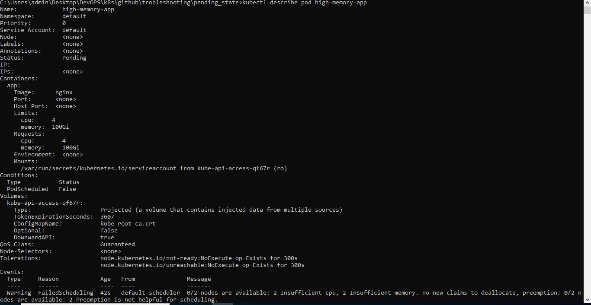
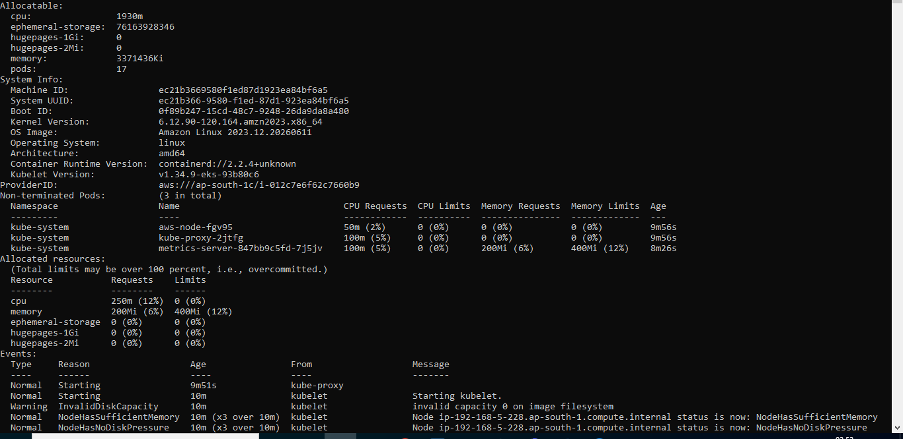
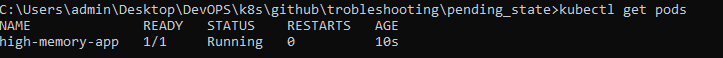

# Kubernetes Production Troubleshooting: Pods Stuck in Pending State

## Scenario Overview

This project demonstrates a common Kubernetes scheduling issue where a Pod remains in the `Pending` state because its resource requests exceed available cluster capacity.

This is a frequently encountered production problem during traffic spikes, autoscaling events, or incorrect resource configuration.

---

# Business Impact

A newly deployed application could not start because Kubernetes was unable to find a node with sufficient resources.

### Impact

* Application unavailable
* Deployment rollout blocked
* Increased latency during scaling events
* Potential customer impact

---

# Environment

| Component  | Value                 |
| ---------- | --------------------- |
| Kubernetes | v1.30+                |
| Cluster    | Minikube / Kind / EKS |
| Runtime    | containerd            |
| Namespace  | default               |

---

# Error Creation

Deploy the following manifest:

```bash
kubectl apply -f manifests/pending-pod.yaml
```

The pod intentionally requests:

```yaml
memory: 100Gi
cpu: 4
```

which exceeds available node capacity.

---

# Symptoms

Check pod status:

```bash
kubectl get pods
```

Output:

```text
NAME              READY   STATUS
high-memory-app   0/1     Pending
```

Screenshot:

```text
screenshots/01-pending-pod.png
```

---

# Investigation

## Step 1: Verify Pod Status

```bash
kubectl get pods
```

Observed:

```text
Pending
```
Screenshot:


---

## Step 2: Describe Pod

```bash
kubectl describe pod high-memory-app
```

Observed:

```text
Warning  FailedScheduling

0/2 nodes are available:
Insufficient memory
```

Screenshot:




---

## Step 3: Inspect Node Capacity

```bash
kubectl top nodes
```

or

```bash
kubectl describe node <node-name>
```

Observed:

```text
Allocatable Memory: 8Gi
Requested Memory: 100Gi
```

Screenshot:



---

# Root Cause Analysis (RCA)

## Incident Summary

Application pods remained in Pending state after deployment.

## Root Cause

The pod requested 100Gi of memory while the cluster nodes only had approximately 8Gi allocatable memory.

The Kubernetes Scheduler could not find a suitable node.

## Impact

* Application deployment blocked
* No workload execution
* Service unavailable

## Detection

Detected using:

```bash
kubectl get pods
kubectl describe pod
```

## Resolution

Reduced resource requests to realistic values.

## Preventive Actions

* Capacity planning
* Resource request reviews
* Cluster Autoscaler
* Monitoring scheduler failures

---

# Resolution

Delete the faulty pod:

```bash
kubectl delete pod high-memory-app
```

Deploy corrected manifest:

```bash
kubectl apply -f manifests/fixed-pod.yaml
```

---

# Validation

Verify pod status:

```bash
kubectl get pods
```

Output:

```text
NAME              READY   STATUS
high-memory-app   1/1     Running
```

Screenshot:



---

# Commands Used

```bash
kubectl get pods

kubectl describe pod high-memory-app

kubectl top nodes

kubectl describe node <node-name>

kubectl delete pod high-memory-app

kubectl apply -f manifests/fixed-pod.yaml
```

---

# Lessons Learned

1. Resource requests directly affect scheduling.
2. Scheduler events are the first place to investigate Pending pods.
3. Capacity planning is critical for production clusters.
4. Cluster Autoscaler helps avoid scheduling failures.
5. Resource quotas and reviews prevent misconfigurations.

---

# Skills Demonstrated

* Kubernetes Scheduling
* Resource Management
* Capacity Planning
* Troubleshooting Pending Pods
* Root Cause Analysis (RCA)
* Incident Response
* DevOps Operations
* SRE Practices

---

# Outcome

✅ Root Cause Identified

✅ Scheduling Issue Resolved

✅ Application Running

✅ Preventive Controls Implemented
