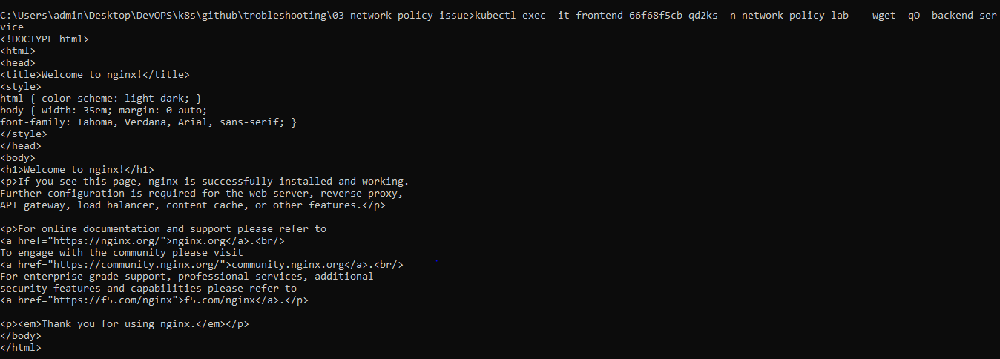
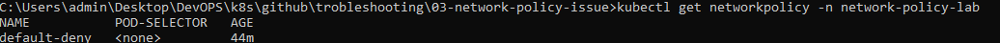
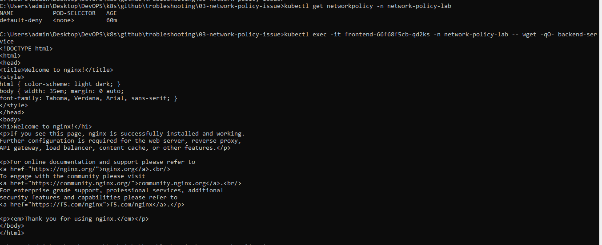
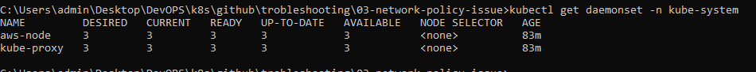

# Kubernetes Production Troubleshooting: NetworkPolicy Applied But Traffic Still Allowed (EKS)

## Scenario Overview

This project demonstrates a real-world Kubernetes networking issue in Amazon EKS where a default-deny NetworkPolicy was deployed to restrict application traffic, but communication between pods continued successfully.

The investigation revealed that although the NetworkPolicy object existed in the Kubernetes API, the cluster did not have a NetworkPolicy enforcement engine installed.

---

# Business Impact

The Security Team expected traffic restrictions to be enforced between application components.

However, application traffic remained unrestricted.

## Potential Risks

* Security policies ineffective
* Unauthorized east-west traffic between pods
* Compliance violations
* False sense of security

---

# Environment

| Component          | Value               |
| ------------------ | ------------------- |
| Platform           | Amazon EKS          |
| Region             | ap-south-1          |
| Node Type          | t3.medium           |
| Nodes              | 3                   |
| Namespace          | network-policy-lab  |
| CNI                | Amazon VPC CNI      |
| Kubernetes Version | EKS Managed Cluster |

---

# Architecture

```text
Frontend Pod
      |
      | HTTP Request
      |
      V
Backend Service
      |
      V
Backend Pod (NGINX)

Expected:
NetworkPolicy blocks traffic

Actual:
Traffic allowed
```

---

# Objective

Investigate why a default-deny NetworkPolicy did not block traffic between pods.

---

# Deployment

## Create Namespace

```bash
kubectl apply -f namespace.yaml
```

## Deploy Backend

```bash
kubectl apply -f backend.yaml
```

## Deploy Frontend

```bash
kubectl apply -f frontend.yaml
```

Verify:

```bash
kubectl get pods -n network-policy-lab
```

Expected:

```text
NAME                        READY   STATUS
backend-xxxxxxxxx           1/1     Running
frontend-xxxxxxxxx          1/1     Running
```

---

# Baseline Connectivity Test

Obtain frontend pod name:

```bash
kubectl get pods -n network-policy-lab
```

Test connectivity:

```bash
kubectl exec -it <frontend-pod> \
-n network-policy-lab \
-- wget -qO- backend-service
```

Expected:

```html
<!DOCTYPE html>
<html>
...
```

Screenshot:



---

# Introduce Security Policy

Apply default deny policy:

```bash
kubectl apply -f deny-all.yaml
```

Verify:

```bash
kubectl get networkpolicy -n network-policy-lab
```

Output:

```text
NAME           POD-SELECTOR
default-deny   <none>
```

Screenshot:



---

# Symptoms

A default-deny NetworkPolicy was successfully deployed.

Expected behavior:

```text
Frontend Pod
    X
Backend Pod
```

Actual behavior:

Traffic continued successfully.

Run:

```bash
kubectl exec -it <frontend-pod> \
-n network-policy-lab \
-- wget -qO- backend-service
```

Output:

```html
<!DOCTYPE html>
<html>
...
```

Screenshot:



---

# Investigation

## Step 1: Verify NetworkPolicy Exists

```bash
kubectl get networkpolicy -n network-policy-lab
```

Output:

```text
NAME           POD-SELECTOR
default-deny   <none>
```

Policy exists.

---

## Step 2: Verify Traffic

```bash
kubectl exec -it <frontend-pod> \
-n network-policy-lab \
-- wget -qO- backend-service
```

Result:

Traffic succeeds.

---

## Step 3: Inspect Cluster Networking Components

Check networking daemonsets:

```bash
kubectl get daemonset -n kube-system
```

Output:

```text
NAME         DESIRED   CURRENT   READY
aws-node     3         3         3
kube-proxy   3         3         3
```

Screenshot:



Observation:

No NetworkPolicy-capable enforcement engine present.

Missing examples:

```text
calico-node
cilium
```

---

## Step 4: Inspect System Pods

```bash
kubectl get pods -n kube-system
```

Output:

```text
aws-node
coredns
kube-proxy
metrics-server
```

Observation:

Only Amazon VPC CNI and kube-proxy are installed.

---

# Root Cause Analysis (RCA)

## Incident Summary

A default-deny NetworkPolicy was deployed to restrict traffic between frontend and backend workloads.

Despite the policy being present, traffic continued to flow normally.

---

## Root Cause

The EKS cluster did not contain a NetworkPolicy enforcement engine.

The cluster was running:

```text
aws-node
kube-proxy
```

NetworkPolicy objects were successfully stored in the Kubernetes API.

However, no component existed to translate those policies into actual packet-filtering rules.

As a result, traffic remained unrestricted.

---

## Evidence

### NetworkPolicy Exists

```bash
kubectl get networkpolicy -n network-policy-lab
```

Output:

```text
default-deny
```

### Traffic Still Allowed

```bash
kubectl exec -it <frontend-pod> \
-n network-policy-lab \
-- wget -qO- backend-service
```

Output:

```html
<!DOCTYPE html>
<html>
...
```

### Missing Enforcement Engine

```bash
kubectl get daemonset -n kube-system
```

Output:

```text
aws-node
kube-proxy
```

No Calico or Cilium components detected.

---

## Impact

* Security controls ineffective
* Pod-to-pod communication unrestricted
* Compliance risk
* Increased attack surface

---

## Resolution

Planned remediation:

1. Enable EKS Network Policy support
2. Install Calico or another supported policy engine
3. Validate policy enforcement
4. Re-test application communication

---

## Preventive Actions

* Validate NetworkPolicy enforcement during cluster provisioning
* Include connectivity tests in CI/CD pipelines
* Review networking architecture before security rollouts
* Document CNI limitations
* Implement security acceptance testing

---

# Validation

Validated:

✅ NetworkPolicy object existed

✅ Traffic still flowed

✅ NetworkPolicy enforcement engine missing

✅ Root cause identified

---

# Screenshots

## 1. Connectivity Before Policy


---

## 2. NetworkPolicy Created


---

## 3. Traffic Still Allowed


---

## 4. Missing Enforcement Engine


---

# Commands Used

```bash
kubectl get pods -n network-policy-lab

kubectl get svc -n network-policy-lab

kubectl get networkpolicy -n network-policy-lab

kubectl describe networkpolicy default-deny -n network-policy-lab

kubectl exec -it <frontend-pod> \
-n network-policy-lab \
-- wget -qO- backend-service

kubectl get daemonset -n kube-system

kubectl get pods -n kube-system
```

---

# Lessons Learned

1. Creating a NetworkPolicy does not guarantee enforcement.
2. Kubernetes requires a policy-capable networking layer.
3. Security validation should include connectivity testing.
4. EKS networking architecture must be reviewed before implementing security controls.
5. Always verify the enforcement mechanism, not just the policy object.

---

# Skills Demonstrated

* Kubernetes Networking
* Amazon EKS Troubleshooting
* NetworkPolicy Analysis
* Security Controls Validation
* Root Cause Analysis (RCA)
* Incident Investigation
* Kubernetes Architecture
* DevOps Troubleshooting
* Production Support

---

# Outcome

✅ Root Cause Identified

✅ Security Gap Discovered

✅ Networking Architecture Analyzed

✅ Production-Grade RCA Completed
