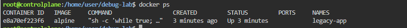
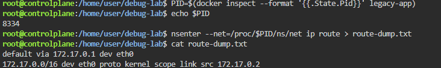
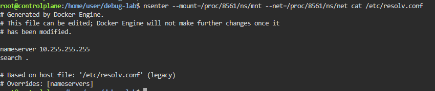
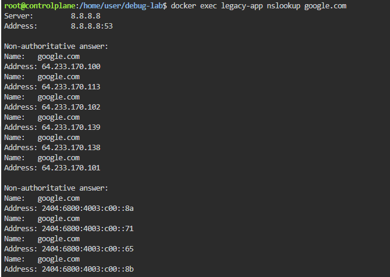

# 🔬 SRE Forensic Lab — Container Network Debugging via Namespace Injection

> Hands-on SRE lab practiced locally using Docker + Linux namespaces  
> **Goal:** Debug a distroless container with broken DNS using `nsenter` — without modifying or shelling into the container

---

## 📋 Table of Contents

- [Lab Environment](#️-lab-environment)
- [Task 1 — Launch the Broken Container](#task-1--launch-the-broken-container)
- [Task 2 — Forensic Analysis via Namespace Injection](#task-2--forensic-analysis-via-namespace-injection)
- [Task 3 — Remediation via Immutable Replacement](#task-3--remediation-via-immutable-replacement)
- [Complete Solution Script](#-complete-solution-script)
- [Concept Summary](#-concept-summary)

---

## 🛠️ Lab Environment

| Tool | Version | Purpose |
|------|---------|---------|
| Docker | 24.x+ | Container runtime |
| nsenter | (built-in Linux) | Namespace injection tool |
| alpine | Latest | Minimal container image (simulates distroless) |
| OS | Ubuntu 22.04 | Host machine |

### The Problem Statement

You are an SRE on call. A critical production container named `legacy-app` has **lost network connectivity**. The application team cannot figure out why.

The catch — this container is **distroless/alpine**: no shell, no `ping`, no `netstat`, no debugging tools. You **cannot exec into it**.

> The root cause: someone deployed the container with `--dns 10.255.255.255` — a non-existent DNS server. All hostname lookups silently fail. The network interface is up and routing is fine, but DNS is completely broken.

---

## Task 1 — Launch the Broken Container

### 🎯 Objective
Simulate a real-world configuration drift by launching a container with an intentionally broken DNS setting.

### 📝 Concepts Covered
- Docker `--dns` flag and how it sets `/etc/resolv.conf` inside a container
- Configuration drift — how a single wrong flag silently breaks an entire service
- Detached container lifecycle (`-d`) and keeping a container alive with a sleep loop

### ⚙️ Commands

**Create the working directory and launch the broken container:**
```bash
mkdir -p /home/user/debug-lab
cd /home/user/debug-lab

docker run -d \
  --name legacy-app \
  --dns 10.255.255.255 \
  alpine \
  sh -c "while true; do sleep 30; done"
```

**Verify the container is running:**
```bash
docker ps --filter name=legacy-app
```

**What each flag does:**

| Flag | Purpose |
|------|---------|
| `-d` | Run in detached (background) mode |
| `--name legacy-app` | Name the container for easy reference |
| `--dns 10.255.255.255` | Forces a non-existent DNS server — the misconfiguration |
| `alpine` | Minimal Linux image (simulates distroless) |
| `sh -c "while true; do sleep 30; done"` | Keeps the container alive with no real app |

### 📸 Screenshot



### ✅ Outcome
- Container `legacy-app` launched successfully in detached mode
- `docker ps` confirms `STATUS=Up`
- Container is alive but has a broken DNS configuration baked in

---

## Task 2 — Forensic Analysis via Namespace Injection

### 🎯 Objective
Without stopping, shelling into, or modifying the container — extract the routing table and DNS configuration using `nsenter` to identify the root cause of the network failure.

### 📝 Concepts Covered
- Linux Network Namespaces — every container gets its own isolated copy of the network stack (interfaces, routing, DNS, firewall rules)
- `nsenter --net` — entering a container's network namespace from the host using the container's PID
- `/proc/<PID>/ns/net` — the namespace file on the host that represents the container's network world
- Forensic-first debugging — collect artifacts before making any changes

### ⚙️ Commands

**Step 1 — Find the container's PID on the host:**
```bash
PID=$(docker inspect --format '{{.State.Pid}}' legacy-app)
echo $PID
# Output: something like 8334
```

**Step 2 — Artifact A: Capture the routing table:**
```bash
nsenter --net=/proc/$PID/ns/net ip route > route-dump.txt
cat route-dump.txt
```

Expected output:
```
default via 172.17.0.1 dev eth0
172.17.0.0/16 dev eth0 proto kernel scope link src 172.17.0.2
```

**Step 3 — Artifact B: Capture the DNS configuration:**
```bash
nsenter --net=/proc/$PID/ns/net cat /etc/resolv.conf > dns-config.txt
cat dns-config.txt
```

Expected output:
```
nameserver 10.255.255.255
```

### 📸 Screenshot — Artifact A: Routing Table



### 📸 Screenshot — Artifact B: DNS Config (Root Cause Found)



### 🔍 Root Cause Analysis

| Artifact | Content | Conclusion |
|----------|---------|------------|
| `route-dump.txt` | `default via 172.17.0.1 dev eth0` | Routing is working — NOT the problem |
| `dns-config.txt` | `nameserver 10.255.255.255` | DNS is broken — **THIS is the root cause** |

> The routing table proves packets can leave the container. The DNS config reveals that every single hostname lookup points to a non-existent server (`10.255.255.255`). The application appears broken, but the real cause is a single misconfigured flag.

### ✅ Outcome
- Found the container's host PID using `docker inspect`
- Used `nsenter --net` to enter the container's network namespace without modifying it
- Confirmed routing is healthy (default gateway `172.17.0.1` is reachable)
- Identified root cause: `nameserver 10.255.255.255` — a non-existent DNS server

---

## Task 3 — Remediation via Immutable Replacement

### 🎯 Objective
Apply the **Immutable Infrastructure** principle — destroy the broken container and replace it with a correctly configured one. Verify the fix with a live DNS resolution test.

### 📝 Concepts Covered
- Immutable Infrastructure — never patch a broken container in place; destroy and redeploy
- Google Public DNS (`8.8.8.8`) as a reliable nameserver
- `nslookup` for DNS resolution testing
- Verifying end-to-end network connectivity post-remediation

### ⚙️ Commands

**Step 1 — Destroy the broken container:**
```bash
docker rm -f legacy-app
```

**Step 2 — Launch the healthy replacement with working DNS:**
```bash
docker run -d \
  --name legacy-app \
  --dns 8.8.8.8 \
  alpine \
  sh -c "while true; do sleep 30; done"
```

**Step 3 — Verify DNS resolution works:**
```bash
docker exec legacy-app nslookup google.com
```

Expected output:
```
Server:    8.8.8.8
Address:   8.8.8.8:53

Non-authoritative answer:
Name:      google.com
Address:   64.233.170.xxx
```

### 📸 Screenshot



### ✅ Outcome
- Broken container destroyed with `docker rm -f`
- Healthy replacement launched with `--dns 8.8.8.8` (Google Public DNS)
- `nslookup google.com` successfully resolved — incident closed
- Zero downtime-style replacement following immutable infrastructure principles

---

## 📜 Complete Solution Script

```bash
#!/bin/bash
# =============================================================
# SRE Forensic Lab — Complete Solution
# =============================================================

# ── SETUP ────────────────────────────────────────────────────
mkdir -p /home/user/debug-lab
cd /home/user/debug-lab
docker rm -f legacy-app 2>/dev/null || true   # clean slate

# ── TASK 1: Launch broken container ──────────────────────────
docker run -d \
  --name legacy-app \
  --dns 10.255.255.255 \
  alpine \
  sh -c "while true; do sleep 30; done"

echo '[+] Container launched with broken DNS'
docker ps --filter name=legacy-app

# ── TASK 2: Forensic Analysis ─────────────────────────────────
PID=$(docker inspect --format '{{.State.Pid}}' legacy-app)
echo "[+] Container PID on host: $PID"

# Artifact A: Routing Table
nsenter --net=/proc/$PID/ns/net ip route > route-dump.txt
echo '[+] Artifact A saved: route-dump.txt'
cat route-dump.txt

# Artifact B: DNS Config
nsenter --mount=/proc/$PID/ns/mnt --net=/proc/$PID/ns/net cat /etc/resolv.conf > dns-config.txt
echo '[+] Artifact B saved: dns-config.txt'
cat dns-config.txt

# ── TASK 3: Remediation ───────────────────────────────────────
docker rm -f legacy-app

docker run -d \
  --name legacy-app \
  --dns 8.8.8.8 \
  alpine \
  sh -c "while true; do sleep 30; done"

echo '[+] Healthy container launched with Google DNS'

# Verify fix
docker exec legacy-app nslookup google.com
echo '[+] Connectivity verified. Incident resolved.'
```

---

## 📚 Concept Summary

### Tools Used

| Tool | Purpose | Why Used Here |
|------|---------|---------------|
| `docker run --dns` | Set container DNS server | Inject the misconfiguration |
| `docker inspect` | Read container metadata | Get the host-level PID |
| `nsenter --net` | Enter a network namespace | Bypass the no-shell restriction |
| `ip route` | Show routing table | Artifact A — verify gateway |
| `cat /etc/resolv.conf` | Show DNS config | Artifact B — find bad nameserver |
| `docker rm -f` | Force-remove a container | Immutable replacement step |
| `nslookup` | Test DNS resolution | Verify the fix worked |

### Key Principles Demonstrated

- **Immutable Infrastructure** — never patch a broken container; destroy and replace it
- **Namespace Injection** — host tools can reach inside any container via `nsenter`
- **Forensic-First Debugging** — collect artifacts before making any changes
- **Defense in Depth** — distroless containers reduce attack surface but require host-level debugging skills
- **Configuration Drift** — a single wrong flag (`--dns`) can silently break an entire service

### Why `nsenter` Is the Industry Standard

```
┌─────────────────────────────────────────────────────┐
│  HOST OS                                            │
│                                                     │
│   nsenter --net=/proc/3821/ns/net  ip route         │
│       │                                             │
│       ▼  enters namespace file on host              │
│   /proc/3821/ns/net  ◄──── container's network ns  │
│                                                     │
│  ┌──────────────────────────────────────────────┐   │
│  │  CONTAINER NETWORK NAMESPACE                 │   │
│  │  eth0  ·  routing table  ·  /etc/resolv.conf │   │
│  │  (container has NO shell, NO tools)          │   │
│  └──────────────────────────────────────────────┘   │
└─────────────────────────────────────────────────────┘
```

> Even if a container has absolutely nothing installed, its **network namespace is still a file on the host**. `nsenter` lets you enter that namespace and run host-level tools inside it — the container never needs any tools of its own.

---

## 📁 Repository Structure

```
sre-forensic-labs/
├── README.md                          ← this file
├── solution.sh                        ← complete runnable bash script
├── screenshots/
│   ├── task1-container-launched.png   ← docker ps showing legacy-app Up
│   ├── task2a-route-dump.png          ← nsenter ip route output
│   ├── task2b-dns-config.png          ← resolv.conf showing broken DNS
│   └── task3-nslookup-verified.png    ← nslookup google.com success
└── artifacts/
    ├── route-dump.txt                 ← routing table (saved output)
    └── dns-config.txt                 ← broken DNS config (saved output)
```

---

## 📖 References

- [Linux Namespaces — man page](https://man7.org/linux/man-pages/man7/namespaces.7.html)
- [nsenter — man page](https://man7.org/linux/man-pages/man1/nsenter.1.html)
- [Docker — Distroless Containers](https://github.com/GoogleContainerTools/distroless)
- [Google SRE Book](https://sre.google/sre-book/table-of-contents/)

---

*Practiced and maintained by [Lasvanthi R](https://github.com/Lasvanthi1)*
