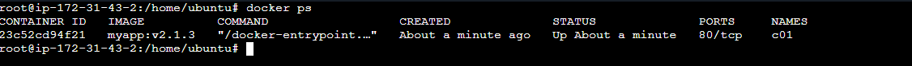
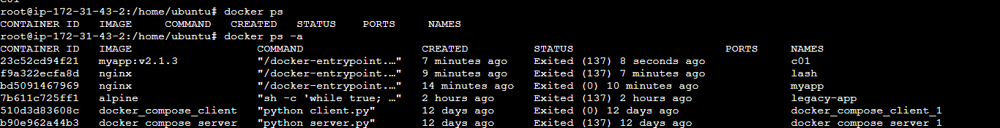
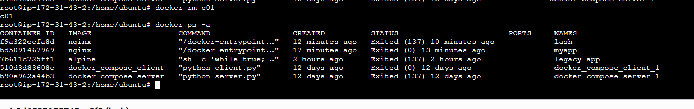
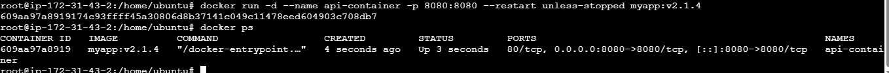
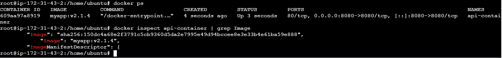

# 🐳 Lab 02 — Docker Manual Rollout

> Hands-on Docker lab practiced locally — manual container version upgrade in a production-like environment  
> **Goal:** Safely update a running container from `myapp:v2.1.3` to `myapp:v2.1.4` without Kubernetes or Swarm

---

## 📋 Table of Contents

- [Lab Environment](#️-lab-environment)
- [Scenario](#-scenario)
- [Task 1 — Verify Existing Container](#task-1--verify-existing-container)
- [Task 2 — Stop the Running Container](#task-2--stop-the-running-container)
- [Task 3 — Remove the Old Container](#task-3--remove-the-old-container)
- [Task 4 — Deploy the Updated Container](#task-4--deploy-the-updated-container)
- [Task 5 — Verify the Updated Container](#task-5--verify-the-updated-container)
- [Understanding Guide](#-understanding-guide)
- [Downtime Risk Analysis](#-downtime-risk-analysis)

---

## 🛠️ Lab Environment

| Tool | Version | Purpose |
|------|---------|---------|
| Docker | 24.x+ | Container runtime |
| myapp:v2.1.3 | Old image | Buggy production version |
| myapp:v2.1.4 | New image | Patched production version |
| OS | Ubuntu 22.04 | Host machine |
| Working Directory | `/home/user` | Lab working path |

---

## 🎬 Scenario

You are managing a **production server** running a critical application at version `v2.1.3`. A severe bug has been identified. The development team has released a patched image `myapp:v2.1.4`.

This environment has **no Kubernetes, no Docker Swarm** — the update must be done manually, step by step.

---

## Task 1 — Verify Existing Container

### 🎯 Objective
Confirm the currently running container name and image version before making any changes. Always verify the current state before touching production.

### 📝 Concepts Covered
- `docker ps` — lists only running containers with their image, status, and port mappings
- Container name vs image name — `api-container` is the container name, `myapp:v2.1.3` is the image it was built from
- Image tagging — the `:v2.1.3` part is the version tag, how Docker tracks different releases of the same image

### ⚙️ Commands

```bash
docker ps
```

Expected output:
```
CONTAINER ID   IMAGE          STATUS        PORTS
a1b2c3d4       myapp:v2.1.3   Up 5 mins     0.0.0.0:8080->8080/tcp
```

**What to look for:**

| Field | Value | What It Means |
|-------|-------|---------------|
| IMAGE | `myapp:v2.1.3` | Old buggy version — needs updating |
| STATUS | `Up 5 mins` | Container is live and serving traffic |
| PORTS | `0.0.0.0:8080->8080/tcp` | Host port 8080 mapped to container port 8080 |

### 📸 Screenshot



### ✅ Outcome
- Confirmed `api-container` is running `myapp:v2.1.3`
- Port mapping `8080:8080` noted — must be preserved in the new container
- Container is live — any action from here causes downtime

---

## Task 2 — Stop the Running Container

### 🎯 Objective
Gracefully stop the running container before removing it. This is the point where **downtime begins**.

### 📝 Concepts Covered
- `docker stop` sends a `SIGTERM` signal to the container's main process — gives it time to shut down cleanly (default 10 second grace period)
- Difference between `docker stop` (graceful) vs `docker kill` (immediate, no cleanup)
- This is the start of the downtime window — traffic to port 8080 will fail from this moment

### ⚙️ Commands

```bash
docker stop api-container
```

Expected output:
```
api-container
```

**Verify it stopped:**
```bash
docker ps
# api-container should no longer appear

docker ps -a
# api-container appears here with STATUS=Exited
```

### 📸 Screenshot



### ✅ Outcome
- `api-container` stopped gracefully with `SIGTERM`
- `docker ps` confirms no running containers
- `docker ps -a` shows container in `Exited` state — still exists, not yet removed
- ⚠️ Downtime window has started

---

## Task 3 — Remove the Old Container

### 🎯 Objective
Delete the stopped container to free up the container name `api-container` so the new container can reuse it.

### 📝 Concepts Covered
- Container names are unique — you cannot have two containers with the same name simultaneously
- `docker rm` removes the container record but NOT the image — the `myapp:v2.1.3` image still exists on disk
- Difference: `docker rm` (remove container) vs `docker rmi` (remove image)
- `docker rm -f` can force-remove a running container — skips `docker stop` step (not recommended in production)

### ⚙️ Commands

```bash
docker rm api-container
```

Expected output:
```
api-container
```

**Verify it is fully removed:**
```bash
docker ps -a
# api-container should not appear at all now
```

### 📸 Screenshot



### ✅ Outcome
- `api-container` fully removed from Docker's container list
- Container name `api-container` is now free to be reused
- Image `myapp:v2.1.3` still exists on disk — only the container was removed
- ⚠️ Downtime window is still active

---

## Task 4 — Deploy the Updated Container

### 🎯 Objective
Launch the new patched container using `myapp:v2.1.4` with the same production configuration as before — same name, same port, with a restart policy.

### 📝 Concepts Covered
- `docker run -d` — detached mode, runs in background
- `-p 8080:8080` — port mapping: `host_port:container_port`
- `--restart unless-stopped` — container auto-restarts if it crashes or host reboots, unless manually stopped
- Restart policies: `no` / `always` / `on-failure` / `unless-stopped`
- Using the same container name ensures any scripts or monitoring pointing to `api-container` keep working

### ⚙️ Commands

```bash
docker run -d \
  --name api-container \
  -p 8080:8080 \
  --restart unless-stopped \
  myapp:v2.1.4
```

**What each flag does:**

| Flag | Purpose |
|------|---------|
| `-d` | Run in detached (background) mode |
| `--name api-container` | Reuse the same container name as before |
| `-p 8080:8080` | Map host port 8080 to container port 8080 |
| `--restart unless-stopped` | Auto-restart on crash or reboot |
| `myapp:v2.1.4` | The new patched image version |

### 📸 Screenshot



### ✅ Outcome
- New container launched from `myapp:v2.1.4`
- Same name, same port, same configuration as old container
- Restart policy set — container survives crashes and reboots
- ✅ Downtime window ends here

---

## Task 5 — Verify the Updated Container

### 🎯 Objective
Confirm the new container is running the correct image version and is healthy before considering the rollout complete.

### 📝 Concepts Covered
- Always verify after every deployment — never assume it worked
- `docker ps` confirms running state and image version
- `docker inspect` gives deeper health and config details
- Port mapping verification ensures traffic is flowing correctly

### ⚙️ Commands

**Basic verification:**
```bash
docker ps
```

Expected output:
```
CONTAINER ID   IMAGE          STATUS         PORTS
x9y8z7w6       myapp:v2.1.4   Up 10 secs     0.0.0.0:8080->8080/tcp
```

**Deep verification:**
```bash
# Confirm image version
docker inspect api-container | grep Image

# Check restart policy
docker inspect api-container | grep -A3 RestartPolicy

# Check port mapping
docker inspect api-container | grep -A5 Ports

# Check live logs
docker logs api-container
```

### 📸 Screenshot



### ✅ Outcome
- `api-container` running `myapp:v2.1.4` confirmed
- Status shows `Up` — container is healthy
- Port `8080:8080` mapping intact
- Restart policy `unless-stopped` applied
- Rollout complete ✅

---

## 📖 Understanding Guide

### What Actually Happens Inside Docker During This Lab

```
BEFORE ROLLOUT
──────────────
Host Port 8080
      │
      ▼
api-container (myapp:v2.1.3) ← serving traffic ✅

DURING ROLLOUT (downtime window)
─────────────────────────────────
docker stop api-container   → SIGTERM sent → container exits
docker rm api-container     → container record deleted
                            → port 8080 is FREE but no one is listening
                            → ⚠️ requests to :8080 fail here

AFTER ROLLOUT
─────────────
docker run myapp:v2.1.4
      │
      ▼
api-container (myapp:v2.1.4) ← serving traffic ✅
Host Port 8080 re-bound
```

---

### Restart Policy — Which One to Use?

| Policy | Behaviour | Use Case |
|--------|-----------|----------|
| `no` | Never restart (default) | Dev/test containers |
| `always` | Always restart, even if manually stopped | System services |
| `unless-stopped` | Restart on crash/reboot, NOT if manually stopped | ✅ Production apps |
| `on-failure` | Only restart on non-zero exit code | Batch jobs |

`unless-stopped` is the best choice for production — it protects against crashes and reboots, but respects your manual `docker stop` commands.

---

### `docker stop` vs `docker kill` — What's the Difference?

```bash
docker stop api-container
# Sends SIGTERM → waits 10 seconds → sends SIGKILL if still running
# App gets time to: flush logs, close DB connections, finish requests
# ✅ Use this in production always

docker kill api-container
# Sends SIGKILL immediately — no grace period
# App is terminated instantly — may lose data
# ⚠️ Use only when stop is not responding
```

---

### `docker rm` vs `docker rmi` — Common Confusion

```bash
docker rm api-container
# Removes the CONTAINER (the running instance)
# Image myapp:v2.1.3 still exists on disk

docker rmi myapp:v2.1.3
# Removes the IMAGE from disk
# Cannot remove if a container (even stopped) is using it
```

---

## ⚠️ Downtime Risk Analysis

### The Downtime Window in This Lab

```
Timeline:
─────────────────────────────────────────────────────────
T+0   docker stop api-container   → app stops serving   ⚠️ DOWNTIME STARTS
T+2   docker rm api-container     → container removed
T+4   docker run myapp:v2.1.4     → new container starts
T+6   container is Up             → app serving again   ✅ DOWNTIME ENDS

Total downtime: ~6-10 seconds minimum
```

### How This Is Solved in Production

| Approach | How It Eliminates Downtime |
|----------|---------------------------|
| Kubernetes Rolling Update | Starts new pods before killing old ones |
| Docker Swarm | Same — rolling replacement with health checks |
| Blue-Green Deployment | Two environments, switch traffic at load balancer level |
| Nginx Upstream Swap | Point reverse proxy to new container while old is still running |

> This lab deliberately uses the manual approach to make you feel the downtime risk. Once you feel it, you understand **why** Kubernetes rolling updates exist.

---

## 📁 Repository Structure

```
lab02-docker-manual-rollout/
    ├── README.md                          ← this file
    └── screenshots/
        ├── task1-verify-old-container.png
        ├── task2-stop-container.png
        ├── task3-remove-container.png
        ├── task4-deploy-new-container.png
        └── task5-verify-new-container.png
```

---

## 📖 References

- [Docker run reference](https://docs.docker.com/engine/reference/run/)
- [Docker restart policies](https://docs.docker.com/config/containers/start-containers-automatically/)
- [Kubernetes Rolling Updates](https://kubernetes.io/docs/tutorials/kubernetes-basics/update/update-intro/)
- [Blue-Green Deployment Pattern](https://martinfowler.com/bliki/BlueGreenDeployment.html)

---

*Practiced and maintained by [Lasvanthi R](https://github.com/Lasvanthi1)*
