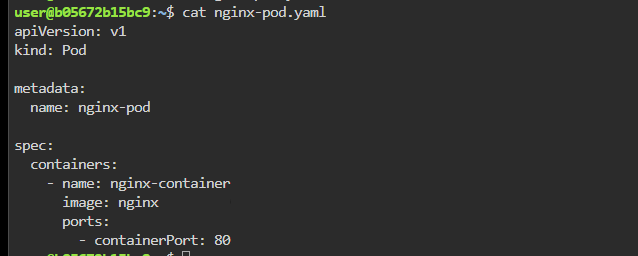
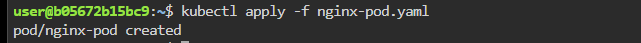
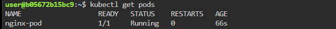
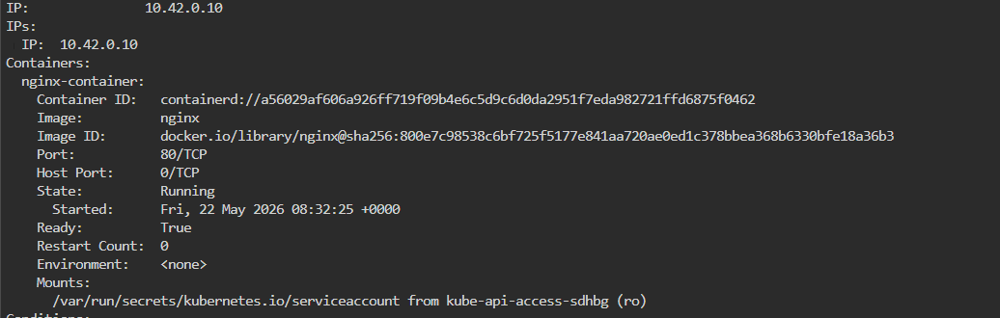
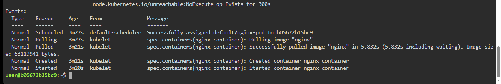
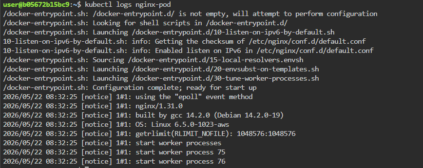
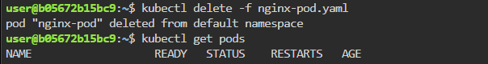

# ☸️ Lab 01 — Kubernetes Pod Creation Using NGINX

> Hands-on Kubernetes lab practiced locally — creating and managing a basic Pod using the NGINX image  
> **Goal:** Deploy a simple NGINX Pod in Kubernetes and understand Pod lifecycle, networking, and verification commands

---

# 📋 Table of Contents

- [Lab Environment](#️-lab-environment)
- [Scenario](#-scenario)
- [Core Concepts](#-core-concepts)
- [Task 1 — Create the Pod YAML](#task-1--create-the-pod-yaml)
- [Task 2 — Deploy the Pod](#task-2--deploy-the-pod)
- [Task 3 — Verify Pod Status](#task-3--verify-pod-status)
- [Task 4 — Inspect Pod Details](#task-4--inspect-pod-details)
- [Task 5 — View Pod Logs](#task-5--view-pod-logs)
- [Task 6 — Delete the Pod](#task-6--delete-the-pod)
- [Understanding Guide](#-understanding-guide)
- [Production Notes](#-production-notes)

---

# 🛠️ Lab Environment

| Tool | Version | Purpose |
|------|---------|---------|
| Kubernetes | v1.28+ | Container orchestration |
| kubectl | v1.28+ | Kubernetes CLI |
| NGINX | Latest | Web server container |
| OS | Ubuntu 22.04 | Host operating system |
| Working Directory | `/home/user` | Lab working path |

---

# 🎬 Scenario

You are a Kubernetes administrator learning how Pods work internally.

Your task is to:

- Create a Pod using the official NGINX image
- Deploy the Pod into the cluster
- Verify Pod lifecycle states
- Access the web server running inside the Pod
- Inspect logs and Pod metadata
- Delete the Pod safely

This lab introduces the most fundamental Kubernetes object:

```text
Pod
```

Everything inside Kubernetes ultimately runs inside Pods.

---

# 📖 Core Concepts

# What is a Pod?

A Pod is the smallest deployable object in Kubernetes.

A Pod can contain:

- One container
- Multiple tightly coupled containers

Example:

```text
Pod
 └── NGINX Container
```

---

# Important Pod Characteristics

| Feature | Description |
|---------|-------------|
| Shared Network | Containers inside a Pod share the same IP |
| Shared Storage | Containers can share volumes |
| Ephemeral | Pods are temporary resources |
| Scheduled | Kubernetes scheduler assigns Pods to nodes |

---

# Pod Lifecycle Overview

```text
kubectl apply
       │
       ▼
API Server stores Pod definition
       │
       ▼
Scheduler selects worker node
       │
       ▼
Kubelet starts container runtime
       │
       ▼
NGINX image pulled
       │
       ▼
Container starts successfully
```

---

# Task 1 — Create the Pod YAML

## 🎯 Objective

Create a Kubernetes Pod manifest using the official NGINX image.

---

# 📝 Concepts Covered

- YAML manifests
- Kubernetes resources
- Container images
- Declarative deployments

---

# ⚙️ Commands

Create the YAML file:

```bash
vi nginx-pod.yaml
```

Paste the following YAML:

```yaml
apiVersion: v1
kind: Pod

metadata:
  name: nginx-pod

spec:
  containers:
    - name: nginx-container
      image: nginx
      ports:
        - containerPort: 80
```

---

# 🔍 YAML Breakdown

| Field | Purpose |
|------|---------|
| `apiVersion: v1` | Kubernetes API version |
| `kind: Pod` | Creates a Pod |
| `metadata.name` | Pod name |
| `containers` | List of containers |
| `image: nginx` | Official NGINX image |
| `containerPort: 80` | HTTP port exposed inside container |

---

# 📸 Screenshot



---

# ✅ Outcome

- Pod YAML created successfully
- NGINX container defined
- Manifest ready for deployment

---

# Task 2 — Deploy the Pod

## 🎯 Objective

Deploy the Pod into the Kubernetes cluster.

---

# 📝 Concepts Covered

- Declarative deployments
- Kubernetes API interaction
- Pod scheduling

---

# ⚙️ Commands

```bash
kubectl apply -f nginx-pod.yaml
```

Expected output:

```bash
pod/nginx-pod created
```

---

# 📸 Screenshot



---

# ✅ Outcome

- Pod submitted successfully
- Scheduler begins node selection
- NGINX image starts downloading

---

# Task 3 — Verify Pod Status

## 🎯 Objective

Verify the Pod is running successfully.

---

# 📝 Concepts Covered

- Pod lifecycle
- Scheduler placement
- Container startup verification

---

# ⚙️ Commands

```bash
kubectl get pods
```

Expected output:

```bash
NAME        READY   STATUS    RESTARTS   AGE
nginx-pod   1/1     Running   0          15s
```

---

# 🔍 Pod Status Meaning

| Status | Meaning |
|-------|---------|
| Pending | Waiting for scheduling or image pull |
| Running | Container started successfully |
| Completed | Task completed successfully |
| Error | Container failure |
| CrashLoopBackOff | Container repeatedly crashing |

---

# 📸 Screenshot



---

# ✅ Outcome

- Pod successfully scheduled
- Container running properly
- Pod entered Running state

---

# Task 4 — Inspect Pod Details

## 🎯 Objective

Inspect Pod metadata, events, node assignment, and container details.

---

# 📝 Concepts Covered

- Pod inspection
- Kubernetes events
- Node scheduling
- Runtime metadata

---

# ⚙️ Commands

```bash
kubectl describe pod nginx-pod
```

---

# 🔍 Important Sections

## Container Information

```text
Containers:
  nginx-container:
    Image: nginx
```

---

## Pod IP

```text
IP: 10.42.0.10
```

---

## Events

```text
Events:
  Pulled
  Created
  Started
```

---

# 📸 Screenshot




---

# ✅ Outcome

- Verified container image
- Verified Pod IP address
- Verified node assignment
- Observed Pod lifecycle events

---

# Task 5 — View Pod Logs

## 🎯 Objective

Inspect logs generated by the NGINX container.

---

# 📝 Concepts Covered

- Container logging
- Runtime debugging
- kubectl logs

---

# ⚙️ Commands

```bash
kubectl logs nginx-pod
```

Expected output:

```text
/docker-entrypoint.sh: Configuration complete; ready for start up
```

---

# 📸 Screenshot



---

# ✅ Outcome

- Logs successfully retrieved
- NGINX startup confirmed
- Container health verified

---

# Task 6 — Delete the Pod

## 🎯 Objective

Delete the Pod from the Kubernetes cluster.

---

# 📝 Concepts Covered

- Resource deletion
- Graceful termination
- Pod cleanup

---

# ⚙️ Commands

```bash
kubectl delete -f nginx-pod.yaml
```

Expected output:

```bash
pod "nginx-pod" deleted
```

Verify deletion:

```bash
kubectl get pods
```

Expected output:

```bash
No resources found
```

---

# 📸 Screenshot



---

# ✅ Outcome

- Pod deleted successfully
- Kubernetes resources cleaned up
- Container terminated gracefully

---

# 📖 Understanding Guide

# What Happens Internally

```text
STEP 1
──────
kubectl apply -f nginx-pod.yaml

        │
        ▼

API Server stores Pod definition

────────────────────────────────────

STEP 2
──────
Scheduler selects worker node

        │
        ▼

Pod assigned to node

────────────────────────────────────

STEP 3
──────
Kubelet starts container runtime

        │
        ▼

NGINX image pulled

────────────────────────────────────

STEP 4
──────
NGINX container starts

        │
        ▼

Pod enters Running state

────────────────────────────────────

STEP 5
──────
kubectl delete

        │
        ▼

Pod terminated gracefully
```

---

# 🌐 Kubernetes Networking Basics

Each Pod receives:

- Unique IP address
- Shared network namespace
- Internal DNS access

Example:

```text
Pod IP → 10.42.0.10
```

All containers inside the Pod share this IP.

---

# ⚠️ Important Notes

| Topic | Explanation |
|------|-------------|
| Pods are ephemeral | Pods may be recreated anytime |
| Pod IP changes | Never depend directly on Pod IP |
| Pods should not store persistent data | Use Volumes instead |
| Single Pod = single failure point | If Pod dies, service stops |

---

# 🚀 Production Notes

In production:

- Pods are usually managed by Deployments
- Deployments provide:
  - Scaling
  - Self-healing
  - Rolling updates
  - Replica management

Instead of:

```text
Single Pod
```

Production typically uses:

```text
Deployment → ReplicaSet → Pods
```

---

# 📁 Repository Structure

```text
lab01-kubernetes-pod-creation/
├── README.md
├── nginx-pod.yaml
└── screenshots/
    ├── task1-create-pod-yaml.png
    ├── task2-deploy-pod.png
    ├── task3-verify-pod-status.png
    ├── task4-describe-pod.png
    ├── task5-view-logs.png
    └── task6-delete-pod.png
```

---

# 📖 References

- :contentReference[oaicite:0]{index=0}
- :contentReference[oaicite:1]{index=1}
- :contentReference[oaicite:2]{index=2}
- :contentReference[oaicite:3]{index=3}

---

# 🧠 Key Takeaways

- Pod is the smallest deployable unit in Kubernetes
- Pods contain one or more containers
- Kubernetes schedules Pods onto worker nodes
- `kubectl apply` creates resources declaratively
- `kubectl describe` helps inspect Pod internals
- `kubectl logs` helps troubleshoot containers
- Port forwarding provides local access to Pods

---

*Practiced and maintained by [Lasvanthi R](https://github.com/Lasvanthi1)*
