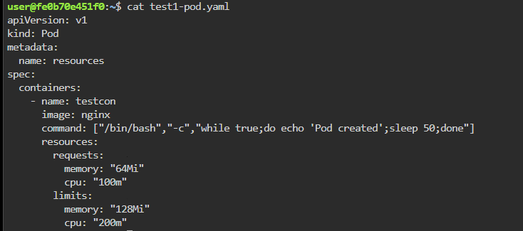
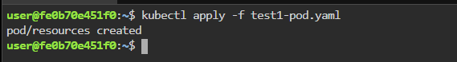
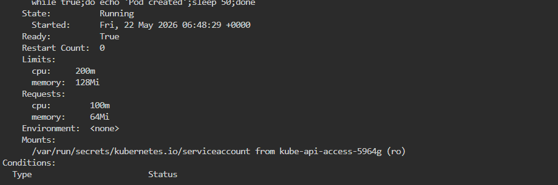

# ☸️ Lab 03 — Kubernetes Resource Requests and Limits

> Hands-on Kubernetes lab practiced locally — understanding CPU and Memory Requests/Limits in Pods  
> **Goal:** Create a Pod with CPU and Memory requests/limits and observe how Kubernetes schedules and controls resource usage

---

# 📋 Table of Contents

- [Lab Environment](#️-lab-environment)
- [Scenario](#-scenario)
- [Core Concepts](#-core-concepts)
- [Task 1 — Create the Pod Manifest](#task-1--create-the-pod-manifest)
- [Task 2 — Apply the Pod Manifest](#task-2--apply-the-pod-manifest)
- [Task 3 — Verify Pod Status](#task-3--verify-pod-status)
- [Task 4 — Inspect Requests and Limits](#task-4--inspect-requests-and-limits)
- [Task 5 — Observe Scheduler Behaviour](#task-5--observe-scheduler-behaviour)
- [CPU and Memory Units Explained](#-cpu-and-memory-units-explained)
- [Understanding Guide](#-understanding-guide)
- [Production Best Practices](#-production-best-practices)
- [Common Mistakes](#-common-mistakes)

---

# 🛠️ Lab Environment

| Tool | Version | Purpose |
|------|---------|---------|
| Kubernetes | v1.28+ | Container orchestration |
| kubectl | v1.28+ | Kubernetes CLI |
| CentOS | Latest | Container image |
| OS | Ubuntu 22.04 | Host machine |
| Working Directory | `/home/user` | Lab working path |

---

# 🎬 Scenario

You are deploying an application container into a Kubernetes cluster.

To ensure cluster stability and fair resource sharing, Kubernetes allows you to define:

- Minimum guaranteed CPU and memory
- Maximum allowed CPU and memory

These are configured using:

- **Requests**
- **Limits**

The Kubernetes scheduler uses these values to determine where Pods should run.

Without resource controls:

- Pods may consume excessive memory
- One container may impact other workloads
- Nodes may become unstable
- Applications may experience starvation

This lab demonstrates how Kubernetes manages resources using Pod specifications.

---

# 📖 Core Concepts

# 1️⃣ Requests

A **request** defines the minimum amount of CPU or memory Kubernetes guarantees to the container.

Example:

```yaml
requests:
  memory: "64Mi"
  cpu: "100m"
```

Meaning:

| Resource | Guaranteed Minimum |
|----------|-------------------|
| Memory | 64Mi |
| CPU | 0.1 CPU core |

---

## Important Behaviour

The Kubernetes scheduler checks node availability using ONLY requests.

Scheduler logic:

```text
Node Free Resources >= Pod Requests ?
```

If enough resources exist:

```text
Pod is scheduled
```

Otherwise:

```text
Pod remains Pending
```

---

# 2️⃣ Limits

A **limit** defines the maximum amount of CPU or memory a container can consume.

Example:

```yaml
limits:
  memory: "128Mi"
  cpu: "200m"
```

Meaning:

| Resource | Maximum Allowed |
|----------|----------------|
| Memory | 128Mi |
| CPU | 0.2 CPU core |

---

# 3️⃣ What Happens When Limits Are Exceeded?

## Memory Limit Exceeded

If a container uses more memory than its limit:
```text
OOMKilled
```
The kernel terminates the container immediately.
---

## CPU Limit Exceeded

If CPU usage exceeds the limit:
- Container is NOT killed
- CPU usage is throttled
- Application performance slows down
---

# Task 1 — Create the Pod Manifest

## 🎯 Objective

Create a Pod YAML file defining:

- CPU request
- Memory request
- CPU limit
- Memory limit

---

# 📝 Concepts Covered

- Kubernetes resource management
- Requests and limits
- Pod specifications
- Resource guarantees

---

# ⚙️ Commands

Create the Pod manifest:

```bash
vi test1-pod.yaml
```

Paste the following YAML:

```yaml
apiVersion: v1
kind: Pod

metadata:
  name: resources

spec:
  containers:
    - name: testcon
      image: centos

      command:
        - "/bin/bash"
        - "-c"
        - "while true; do echo akshat; sleep 50; done"

      resources:
        requests:
          memory: "64Mi"
          cpu: "100m"

        limits:
          memory: "128Mi"
          cpu: "200m"
```

---

# 🔍 YAML Breakdown

| Section | Purpose |
|---------|---------|
| `apiVersion: v1` | Kubernetes API version |
| `kind: Pod` | Creates a Pod object |
| `metadata.name` | Pod name |
| `image: centos` | Container image |
| `command` | Keeps container running |
| `resources.requests` | Minimum guaranteed resources |
| `resources.limits` | Maximum allowed resources |

---

# 📸 Screenshot



---

# ✅ Outcome

- Pod YAML created successfully
- Resource requests configured
- Resource limits configured
- Manifest ready for deployment

---

# Task 2 — Apply the Pod Manifest
## 🎯 Objective
Deploy the Pod into the Kubernetes cluster.
---

# 📝 Concepts Covered

- Declarative deployments
- Kubernetes API interactions
- Pod scheduling workflow

---

# ⚙️ Commands

```bash
kubectl apply -f test1.pod
```

Expected output:

```bash
pod/resources created
```

---

# 📸 Screenshot



---

# ✅ Outcome

- Pod submitted to Kubernetes API server
- Scheduler starts node selection process
- Requests evaluated before placement

---

# Task 3 — Verify Pod Status

## 🎯 Objective

Verify that the Pod is running successfully.

---

# 📝 Concepts Covered

- Pod lifecycle states
- Scheduler placement
- Cluster resource availability

---

# ⚙️ Commands

```bash
kubectl get pods
```

Expected output:

```bash
NAME        READY   STATUS    RESTARTS   AGE
resources   1/1     Running   0          20s
```

---

# 🔍 Pod States

| State | Meaning |
|------|---------|
| Pending | Scheduler finding suitable node |
| Running | Container started successfully |
| CrashLoopBackOff | Container repeatedly crashing |
| OOMKilled | Memory limit exceeded |

---

# 📸 Screenshot


---

# ✅ Outcome

- Pod running successfully
- Node had sufficient requested resources
- Scheduler placement completed

---

# Task 4 — Inspect Requests and Limits

## 🎯 Objective

Verify Kubernetes applied requests and limits correctly.

---

# 📝 Concepts Covered

- Pod inspection
- Resource verification
- Runtime configuration visibility

---

# ⚙️ Commands

```bash
kubectl describe pod resources
```

---

# 🔍 Important Output Section

Expected section:

```bash
Limits:
  cpu:     200m
  memory:  128Mi

Requests:
  cpu:      100m
  memory:   64Mi
```
---

# 📸 Screenshot



---
# ✅ Outcome

- Requests confirmed
- Limits confirmed
- Kubernetes accepted resource configuration
---

# Task 5 — Observe Scheduler Behaviour

## 🎯 Objective

Understand how the Kubernetes scheduler makes placement decisions.
---
# 📝 Concepts Covered
- Scheduler internals
- Node resource calculation
- Pod placement logic
---
# 📖 Scheduler Logic

The scheduler checks:
```text
Available Node Resources >= Pod Requests
```
Example:

```text
Node Free CPU: 500m
Pod CPU Request: 100m

Result:
Pod can be scheduled
```
---
## Example Failure Scenario

```text
Node Free Memory: 32Mi
Pod Memory Request: 64Mi

Result:
Pod remains Pending
```
---
# ⚠️ Important Concept

Scheduler considers ONLY:
- Requests

Scheduler ignores:
- Limits
Because limits are enforced later by the Linux kernel and container runtime.

# ✅ Outcome

- Understood scheduling decisions
- Learned why requests are critical
- Learned how Kubernetes prevents over-allocation

---

# 📖 CPU and Memory Units Explained

# CPU Units

CPU is measured in:

```text
cores
```

Examples:

| Value | Meaning |
|------|---------|
| `1000m` | 1 CPU core |
| `500m` | 0.5 CPU |
| `200m` | 0.2 CPU |
| `100m` | 0.1 CPU |

The `m` means:

```text
millicore
```

---

# Memory Units

Memory is measured in bytes.

Common Kubernetes units:

| Unit | Meaning |
|------|---------|
| Ki | Kibibyte |
| Mi | Mebibyte |
| Gi | Gibibyte |

Examples:

| Value | Approximate Size |
|------|------------------|
| `64Mi` | 64 MB |
| `128Mi` | 128 MB |
| `1Gi` | 1024 MB |

---

# 📖 Understanding Guide

# What Happens Internally in Kubernetes

```text
STEP 1
──────
kubectl apply -f test1.pod

        │
        ▼

API Server stores Pod specification

────────────────────────────────────

STEP 2
──────
Scheduler reads Pod definition

Checks:
- CPU request = 100m
- Memory request = 64Mi

        │
        ▼

Finds suitable worker node

────────────────────────────────────

STEP 3
──────
Scheduler binds Pod to node

        │
        ▼

Kubelet receives assignment

────────────────────────────────────

STEP 4
──────
Container runtime starts container

Limits applied:
- CPU = 200m
- Memory = 128Mi

────────────────────────────────────

STEP 5
──────
If memory exceeds limit:

        ▼

Container terminated → OOMKilled
```

---

# ⚠️ Production Best Practices

| Recommendation | Reason |
|---------------|-------|
| Always define requests | Stable scheduling |
| Always define limits | Prevent noisy neighbors |
| Monitor actual usage | Optimize infrastructure cost |
| Use Horizontal Pod Autoscaler | Dynamic scaling |
| Use ResourceQuota | Namespace-level protection |
| Avoid overly high requests | Prevent Pending Pods |

---

# ⚠️ Common Mistakes

| Mistake | Result |
|---------|--------|
| No requests | Poor scheduling decisions |
| No limits | Resource starvation |
| Very low memory limit | Frequent OOMKilled |
| Very high requests | Pods stuck in Pending |
| CPU limit too low | Application throttling |

---

# 📊 Real Production Example

## Scenario

A Java application needs:

- Guaranteed 512Mi memory
- Guaranteed 0.5 CPU
- Maximum 1Gi memory
- Maximum 1 CPU

Example:

```yaml
resources:
  requests:
    memory: "512Mi"
    cpu: "500m"

  limits:
    memory: "1Gi"
    cpu: "1000m"
```

---

# 📁 Repository Structure

```text
lab03-kubernetes-resource-management/
├── README.md
├── test1.pod
└── screenshots/
    ├── task1-create-pod-manifest.png
    ├── task2-apply-pod.png
    ├── task3-verify-pod-status.png
    ├── task4-describe-pod.png
    └── task5-scheduler-behaviour.png
```

---

# 📖 References

- :contentReference[oaicite:0]{index=0}
- :contentReference[oaicite:1]{index=1}
- :contentReference[oaicite:2]{index=2}
- :contentReference[oaicite:3]{index=3}

---

# 🧠 Key Takeaways

- Requests define guaranteed minimum resources
- Limits define maximum allowed resources
- Scheduler uses requests for placement decisions
- Memory limit violations cause OOMKilled
- CPU limit violations cause throttling
- Proper resource management improves cluster stability

---

*Practiced and maintained by [Lasvanthi R](https://github.com/Lasvanthi1)*
