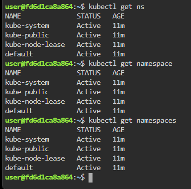

# ☸️ Kubernetes Namespace Management

> Hands-on Kubernetes lab practiced locally — understanding Namespace isolation, organization, and multi-team resource separation  
> **Goal:** Create, manage, and explore Kubernetes Namespaces with real-world production scenarios

---

# 📋 Table of Contents

- [Lab Environment](#️-lab-environment)
- [Scenario](#-scenario)
- [Core Concepts](#-core-concepts)
- [Task 1 — View Existing Namespaces](#task-1--view-existing-namespaces)
- [Task 2 — Create a Namespace](#task-2--create-a-namespace)
- [Task 3 — Deploy a Pod Inside Namespace](#task-3--deploy-a-pod-inside-namespace)
- [Task 4 — Verify Namespace Isolation](#task-4--verify-namespace-isolation)
- [Task 5 — Switch Default Namespace Context](#task-5--switch-default-namespace-context)
- [Task 6 — Create Multiple Team Namespaces](#task-6--create-multiple-team-namespaces)
- [Task 7 — Delete Namespace Resources](#task-7--delete-namespace-resources)
- [Real Production Namespace Examples](#-real-production-namespace-examples)
- [Understanding Guide](#-understanding-guide)
- [Production Best Practices](#-production-best-practices)
- [Common Mistakes](#-common-mistakes)

---

# 🛠️ Lab Environment

| Tool | Version | Purpose |
|------|---------|---------|
| Kubernetes | v1.28+ | Container orchestration |
| kubectl | v1.28+ | Kubernetes CLI |
| NGINX | Latest | Web server container |
| OS | Ubuntu 22.04 | Host machine |
| Working Directory | `/home/user` | Lab working path |

---

# 🎬 Scenario

You are managing a Kubernetes cluster shared by multiple teams:

- Development Team
- QA Team
- Production Team

Each team requires:

- Resource isolation
- Independent deployments
- Separate configurations
- Controlled access

Kubernetes solves this using:

```text
Namespaces
```

Namespaces logically divide a cluster into multiple virtual environments.

This lab demonstrates how Namespaces help organize and isolate workloads in production Kubernetes environments.

---

# 📖 Core Concepts

# What is a Namespace?

A Namespace is a logical partition inside a Kubernetes cluster.

Example:

```text
Kubernetes Cluster
│
├── default
├── kube-system
├── dev
├── qa
└── production
```

Each Namespace can contain:

- Pods
- Services
- Deployments
- ConfigMaps
- Secrets
- ResourceQuotas

---

# Why Namespaces Exist

Namespaces help with:

| Purpose | Explanation |
|---------|-------------|
| Isolation | Separate workloads logically |
| Multi-tenancy | Multiple teams share same cluster |
| Access Control | RBAC per namespace |
| Resource Limits | Control CPU/memory usage |
| Environment Separation | Dev / QA / Prod isolation |

---

# Default Kubernetes Namespaces

Run:

```bash
kubectl get namespaces
```

Expected output:

```text
NAME              STATUS   AGE
default           Active   10d
kube-system       Active   10d
kube-public       Active   10d
kube-node-lease   Active   10d
```

---

# Important Default Namespaces

| Namespace | Purpose |
|-----------|---------|
| `default` | User workloads |
| `kube-system` | Kubernetes internal components |
| `kube-public` | Public cluster resources |
| `kube-node-lease` | Node heartbeat objects |

---

# Task 1 — View Existing Namespaces

## 🎯 Objective

View all Namespaces available inside the Kubernetes cluster.

---

# 📝 Concepts Covered

- Namespace listing
- Cluster logical organization
- Default namespaces

---

# ⚙️ Commands

```bash
kubectl get namespaces
```

OR

```bash
kubectl get ns
```

Expected output:

```text
NAME              STATUS   AGE
default           Active   10d
kube-system       Active   10d
kube-public       Active   10d
kube-node-lease   Active   10d
```

---

# 📸 Screenshot



---

# ✅ Outcome

- Viewed existing namespaces
- Understood Kubernetes default namespaces
- Verified cluster organization

---

# Task 2 — Create a Namespace

## 🎯 Objective

Create a custom Namespace for development workloads.

---

# 📝 Concepts Covered

- Namespace creation
- Logical workload separation
- Multi-environment setup

---

# ⚙️ Commands

Create namespace:

```bash
kubectl create namespace dev
```

Expected output:

```text
namespace/dev created
```

Verify:

```bash
kubectl get ns
```

Expected output:

```text
NAME              STATUS   AGE
dev               Active   5s
default           Active   10d
kube-system       Active   10d
```

---

# 📸 Screenshot


---

# ✅ Outcome

- Development namespace created
- Namespace isolation initialized
- Cluster segmentation improved

---

# Task 3 — Deploy a Pod Inside Namespace

## 🎯 Objective

Deploy an NGINX Pod specifically inside the `dev` Namespace.

---

# 📝 Concepts Covered

- Namespace-specific deployments
- Resource scoping
- Isolated workloads

---

# ⚙️ Commands

Create YAML:

```bash
vi nginx-dev.yaml
```

Paste:

```yaml
apiVersion: v1
kind: Pod

metadata:
  name: nginx-pod
  namespace: dev

spec:
  containers:
    - name: nginx-container
      image: nginx
```

Apply:

```bash
kubectl apply -f nginx-dev.yaml
```

Expected output:

```text
pod/nginx-pod created
```

---

# 📸 Screenshot


---

# ✅ Outcome

- Pod deployed inside `dev` namespace
- Workload isolated from default namespace
- Namespace scoping verified

---

# Task 4 — Verify Namespace Isolation

## 🎯 Objective

Understand how workloads are isolated between namespaces.

---

# 📝 Concepts Covered

- Namespace isolation
- Scoped resource visibility
- Namespace-aware kubectl usage

---

# ⚙️ Commands

Check Pods in default namespace:

```bash
kubectl get pods
```

Expected output:

```text
No resources found
```

---

Check Pods in dev namespace:

```bash
kubectl get pods -n dev
```

Expected output:

```text
NAME        READY   STATUS    RESTARTS   AGE
nginx-pod   1/1     Running   0          20s
```

---

# 🔍 Important Observation

The same cluster contains:

| Namespace | Pods Visible |
|-----------|--------------|
| default | None |
| dev | nginx-pod |

Namespaces isolate visibility.

---

# 📸 Screenshot


---

# ✅ Outcome

- Verified namespace isolation
- Learned namespace-scoped operations
- Observed workload separation

---

# Task 5 — Switch Default Namespace Context

## 🎯 Objective

Change kubectl default Namespace context to avoid repeatedly using `-n`.

---

# 📝 Concepts Covered

- kubectl contexts
- Namespace switching
- Developer productivity

---

# ⚙️ Commands

Set default namespace:

```bash
kubectl config set-context --current --namespace=dev
```

Expected output:

```text
Context modified.
```

Verify:

```bash
kubectl config view --minify | grep namespace:
```

Expected output:

```text
namespace: dev
```

Now run:

```bash
kubectl get pods
```

Expected output:

```text
NAME        READY   STATUS    RESTARTS   AGE
nginx-pod   1/1     Running   0          1m
```

---

# 📸 Screenshot


---

# ✅ Outcome

- kubectl default namespace changed
- Simplified future commands
- Improved operational efficiency

---

# Task 6 — Create Multiple Team Namespaces

## 🎯 Objective

Simulate a real production cluster with multiple team environments.

---

# 📝 Concepts Covered

- Multi-team cluster organization
- Environment segregation
- Enterprise Kubernetes architecture

---

# ⚙️ Commands

Create multiple namespaces:

```bash
kubectl create ns qa
kubectl create ns production
kubectl create ns monitoring
```

Verify:

```bash
kubectl get ns
```

Expected output:

```text
NAME              STATUS   AGE
default           Active   10d
dev               Active   5m
qa                Active   10s
production        Active   10s
monitoring        Active   10s
```

---

# 📸 Screenshot


---

# ✅ Outcome

- Simulated enterprise namespace architecture
- Created isolated environments
- Prepared cluster for multi-team usage

---

# Task 7 — Delete Namespace Resources

## 🎯 Objective

Delete Namespaces and observe automatic resource cleanup.

---

# 📝 Concepts Covered

- Namespace deletion
- Resource garbage collection
- Kubernetes cleanup process

---

# ⚙️ Commands

Delete namespace:

```bash
kubectl delete ns dev
```

Expected output:

```text
namespace "dev" deleted
```

Verify:

```bash
kubectl get ns
```

---

# 🔍 Important Behaviour

Deleting a Namespace removes:

- Pods
- Services
- Deployments
- ConfigMaps
- Secrets

Everything inside that Namespace is deleted automatically.

---

# 📸 Screenshot


---

# ✅ Outcome

- Namespace deleted successfully
- Resources cleaned automatically
- Learned namespace lifecycle management

---

# 🌍 Real Production Namespace Examples

# Example 1 — Environment Separation

```text
production
staging
qa
development
```

Purpose:

| Namespace | Usage |
|-----------|------|
| production | Live customer traffic |
| staging | Pre-production testing |
| qa | QA automation |
| development | Developer workloads |

---

# Example 2 — Team Isolation

```text
frontend-team
backend-team
data-team
security-team
```

Each team manages only its own workloads.

---

# Example 3 — Infrastructure Components

```text
monitoring
logging
ingress-nginx
cert-manager
```

Infrastructure services isolated from applications.

---

# Example 4 — SaaS Multi-Tenant Cluster

```text
customer-a
customer-b
customer-c
```

Each customer gets isolated Kubernetes resources.

---

# 📖 Understanding Guide

# What Happens Internally

```text
STEP 1
──────
kubectl create namespace dev

        │
        ▼

API Server creates Namespace object

────────────────────────────────────

STEP 2
──────
kubectl apply -f nginx-dev.yaml

        │
        ▼

Pod associated with "dev" namespace

────────────────────────────────────

STEP 3
──────
Scheduler assigns Pod to node

        │
        ▼

Pod runs inside isolated namespace

────────────────────────────────────

STEP 4
──────
kubectl get pods

        │
        ▼

kubectl queries current namespace only

────────────────────────────────────

STEP 5
──────
kubectl delete ns dev

        │
        ▼

All namespace resources deleted automatically
```

---

# 🔒 Namespace Isolation Model

```text
Cluster
│
├── Namespace: dev
│     └── nginx-pod
│
├── Namespace: qa
│     └── api-pod
│
└── Namespace: production
      └── payment-pod
```

Resources are logically isolated.

---

# ⚠️ Important Notes

| Topic | Explanation |
|------|-------------|
| Namespaces are logical isolation | Not full security isolation |
| Network traffic still allowed by default | Use NetworkPolicies for isolation |
| Cluster resources shared | Worker nodes shared across namespaces |
| Namespaces do not isolate nodes | Only Kubernetes resources |

---

# 🚀 Production Best Practices

| Recommendation | Reason |
|---------------|-------|
| Separate Dev/QA/Prod namespaces | Environment isolation |
| Apply ResourceQuotas | Prevent resource abuse |
| Use RBAC per namespace | Team access control |
| Use NetworkPolicies | Secure traffic flow |
| Use naming standards | Better cluster organization |
| Avoid using default namespace in production | Better isolation |

---

# ⚠️ Common Mistakes

| Mistake | Result |
|---------|--------|
| Deploying everything in default namespace | Poor organization |
| No ResourceQuota | Resource exhaustion |
| No RBAC | Security risks |
| No namespace naming standards | Operational confusion |
| Assuming namespace = security boundary | False isolation assumption |

---

# 📁 Repository Structure

```text
lab04-kubernetes-namespace-management/
├── README.md
├── nginx-dev.yaml
└── screenshots/
    ├── task1-view-namespaces.png
    ├── task2-create-namespace.png
    ├── task3-deploy-pod-namespace.png
    ├── task4-namespace-isolation.png
    ├── task5-switch-context.png
    ├── task6-multiple-namespaces.png
    └── task7-delete-namespace.png
```

---

# 📖 References

- :contentReference[oaicite:0]{index=0}
- :contentReference[oaicite:1]{index=1}
- :contentReference[oaicite:2]{index=2}
- :contentReference[oaicite:3]{index=3}

---

# 🧠 Key Takeaways

- Namespaces logically divide Kubernetes clusters
- Namespaces isolate workloads and visibility
- Multiple teams can safely share one cluster
- kubectl commands are namespace-aware
- Namespaces improve organization and security
- Production clusters heavily depend on namespace separation

---

*Practiced and maintained by [Lasvanthi R](https://github.com/Lasvanthi1)*
