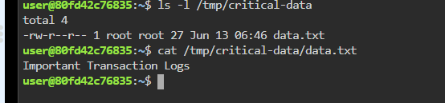
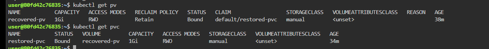
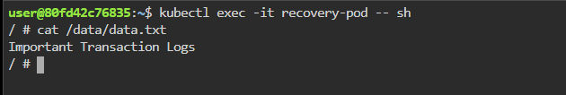

# 🚨 Kubernetes Storage Disaster Recovery Lab

## Recovering Orphaned Persistent Volume Data After Accidental PV Deletion

> Production-style SRE troubleshooting exercise focused on Kubernetes Persistent Volume recovery.

---

# 📖 Scenario

A critical transaction-processing application suddenly goes offline.

Users begin reporting:

* Failed transactions
* Missing application logs
* Pods stuck in CrashLoopBackOff
* Storage mount errors

The on-call SRE team starts investigating.

Initial findings reveal that the Persistent Volume object used by the application has been accidentally deleted from Kubernetes.

At first glance, the situation appears catastrophic because the application can no longer access its storage.

However, further investigation reveals an important detail:

✅ The physical data still exists on the node.

❌ Only the Kubernetes PersistentVolume object is missing.

The transaction logs remain available at:

```bash
/tmp/critical-data
```

The mission is to restore application access without losing data.

---

# 🎯 Objectives

* Investigate storage outage symptoms
* Verify whether data still exists
* Understand Kubernetes PV/PVC relationships
* Recreate a Persistent Volume manually
* Rebind storage using a new PVC
* Validate data integrity
* Restore application access

---

# 🏗 Architecture Before Failure

```text
Application Pod
       │
       ▼
PersistentVolumeClaim
       │
       ▼
PersistentVolume
       │
       ▼
/tmp/critical-data
```

---

# 💥 Failure Event

An administrator accidentally deletes:

```bash
kubectl delete pv original-pv
```

Result:

```text
Application Pod
       │
       ▼
PersistentVolumeClaim
       │
       X
PersistentVolume Deleted
       │
       ▼
Data Still Exists
```

Symptoms observed:

```bash
kubectl get pvc
```

Example:

```text
NAME           STATUS
transaction-pvc Pending
```

Application logs:

```text
Unable to attach or mount volumes
persistentvolume not found
```

Pods may show:

```text
ContainerCreating
Pending
CrashLoopBackOff
```

---

# 🔍 Investigation Phase

## Step 1: Verify PV Status

Check existing Persistent Volumes.

```bash
kubectl get pv
```

Expected finding:

```text
No resources found
```

or

```text
original-pv not present
```

---


---

# 🔍 Step 2: Verify PVC Status

Check PVCs.

```bash
kubectl get pvc
```

Expected:

```text
NAME           STATUS
restored-pvc   Pending
```

or

```text
transaction-pvc Pending
```

PVC cannot bind because no matching PV exists.

---


---

# 🔍 Step 3: Verify Physical Data

Login to the node.

Check whether the storage path still exists.

```bash
ls -l /tmp/critical-data
```

Expected:

```text
data.txt
```

View contents.

```bash
cat /tmp/critical-data/data.txt
```

Expected:

```text
Important Transaction Logs
```

This confirms:

✅ Data is safe

❌ Kubernetes metadata is missing

---


```

---

# 🛠 Recovery Strategy

Since data still exists, create a new PV that points to the existing storage location.

This technique is called:

## Static Provisioning

The new PV effectively "re-adopts" the existing storage.

---

# Step 4: Create Recovered PV

File:

```yaml
apiVersion: v1
kind: PersistentVolume
metadata:
  name: recovered-pv
spec:
  capacity:
    storage: 1Gi

  accessModes:
    - ReadWriteOnce

  persistentVolumeReclaimPolicy: Retain

  storageClassName: manual

  hostPath:
    path: /tmp/critical-data
```

Apply:

```bash
kubectl apply -f recovered-pv.yaml
```

Verify:

```bash
kubectl get pv
```

Expected:

```text
recovered-pv Available
```

---


---

# Step 5: Create Restored PVC

File:

```yaml
apiVersion: v1
kind: PersistentVolumeClaim
metadata:
  name: restored-pvc
spec:
  accessModes:
    - ReadWriteOnce

  storageClassName: manual

  resources:
    requests:
      storage: 1Gi
```

Apply:

```bash
kubectl apply -f restored-pvc.yaml
```

---

# Verify Binding

```bash
kubectl get pvc
kubectl get pv
```

Expected:

```text
PVC Status: Bound
PV Status: Bound
```

Relationship:

```text
restored-pvc
      │
      ▼
recovered-pv
```

---



---

# Step 6: Deploy Validation Pod

Create test pod.

```yaml
apiVersion: v1
kind: Pod
metadata:
  name: recovery-pod
spec:
  containers:
  - name: busybox
    image: busybox
    command:
    - sleep
    - "3600"

    volumeMounts:
    - name: recovered-storage
      mountPath: /data

  volumes:
  - name: recovered-storage
    persistentVolumeClaim:
      claimName: restored-pvc
```

Deploy:

```bash
kubectl apply -f recovery-pod.yaml
```

Verify:

```bash
kubectl get pod
```

Expected:

```text
recovery-pod Running
```

---


---

# Step 7: Validate Recovered Data

Enter the pod.

```bash
kubectl exec -it recovery-pod -- sh
```

Check mounted files.

```bash
ls /data
```

Expected:

```text
data.txt
```

Read file.

```bash
cat /data/data.txt
```

Expected:

```text
Important Transaction Logs
```

Recovery successful.

---


---

# Root Cause Analysis

Root Cause:

```text
Accidental deletion of Kubernetes PV object.
```

Impact:

```text
Application lost storage mapping.
```

Data Loss:

```text
No
```

Reason:

```text
Underlying storage path remained intact.
```

Recovery Method:

```text
Static PV recreation and PVC rebinding.
```

Recovery Time Objective (RTO):

```text
Few minutes
```

Recovery Point Objective (RPO):

```text
Zero
```

---

# Key SRE Learnings

### PV Deletion ≠ Data Deletion

Deleting a Kubernetes PV object does not always remove data.

---

### Retain Policy Protects Data

```yaml
persistentVolumeReclaimPolicy: Retain
```

Prevents Kubernetes from automatically deleting underlying storage.

---

### Static Provisioning Can Recover Orphaned Storage

A new PV can be created that points to existing storage.

---

### Always Investigate Before Restoring

Never assume data loss.

Verify:

```bash
kubectl get pv
kubectl get pvc
kubectl describe pv
kubectl describe pvc
ls storage-path
```

before performing recovery actions.

---

# Final Architecture After Recovery

```text
Recovery Pod
       │
       ▼
restored-pvc
       │
       ▼
recovered-pv
       │
       ▼
/tmp/critical-data
       │
       ▼
Important Transaction Logs
```

---

# Outcome

✅ Application storage restored

✅ Existing transaction logs recovered

✅ Zero data loss

✅ Demonstrated Kubernetes disaster recovery using static provisioning

✅ Real-world SRE troubleshooting workflow for orphaned Persistent Volumes
