# Kubernetes Probes Labs

## Overview

Kubernetes Probes are health-check mechanisms used by the kubelet to determine the health and availability of containers running inside Pods.

They help Kubernetes answer three important questions:

* Is the application alive?
* Is the application ready to receive traffic?
* Has the application completed startup successfully?

Without probes, Kubernetes assumes that a running container is healthy, which may lead to traffic being routed to applications that are still starting, stuck, or unhealthy.

This repository demonstrates all five probe types through hands-on labs:

| Probe Type           | Purpose                                                     |
| -------------------- | ----------------------------------------------------------- |
| Liveness Probe       | Detects hung or deadlocked applications and restarts them   |
| Readiness Probe      | Controls whether a Pod receives traffic                     |
| Startup Probe        | Protects slow-starting applications from premature restarts |
| TCP Socket Probe     | Verifies that a TCP port is accepting connections           |
| Command (Exec) Probe | Executes a custom command to determine application health   |

---

# Lab 1 – Liveness Probe

## What is a Liveness Probe?

A Liveness Probe checks whether an application is still functioning correctly.

If the probe fails repeatedly, Kubernetes assumes the application is unhealthy and automatically restarts the container.

### Real-World Example

Imagine a WhatsApp backend service that experiences a memory leak. The process remains running, but it stops responding to requests. Without a liveness probe, Kubernetes would continue routing traffic to the unhealthy Pod.

A liveness probe detects this condition and automatically restarts the container.

---

## Step 1: Create and Deploy the Pod

```bash
kubectl apply -f liveness.yaml
```

### Screenshot

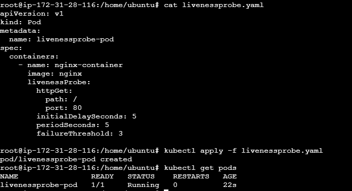

```bash

kubectl get pods
```

Expected:

```text
NAME                READY   STATUS    RESTARTS
livenessprobe-pod   1/1     Running   0
```

### Explanation

The Pod is created successfully and Kubernetes starts monitoring the liveness endpoint configured in the Pod specification.

---

## Step 2: Verify Probe Configuration

```bash
kubectl describe pod livenessprobe-pod
```

### Screenshot

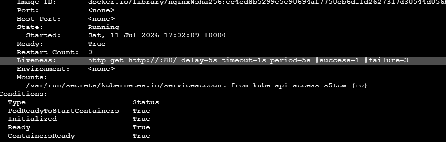
Capture:

```text
Liveness:
http-get http://:80/
```

### Explanation

The kubelet performs an HTTP GET request against port 80 every few seconds. If the endpoint stops responding, Kubernetes marks the probe as failed.

---

## Step 3: Simulate Application Failure

```bash
kubectl exec -it livenessprobe-pod -- bash

nginx -s stop

exit
```

### Screenshot

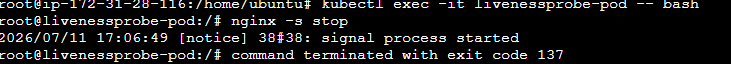

### Explanation

Stopping Nginx simulates an application crash. The container remains running briefly, but the HTTP endpoint becomes unavailable.

---

## Step 4: Observe Automatic Restart

```bash
kubectl get pods -w
```

### Screenshot

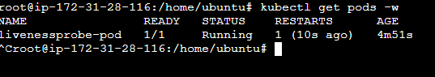

Expected:

```text
RESTARTS   1
```

### Explanation

The liveness probe fails multiple times according to the configured failure threshold. Kubernetes then kills and recreates the container automatically.

---

## Step 5: Verify Restart Evidence

```bash
kubectl describe pod livenessprobe-pod
```

### Screenshot

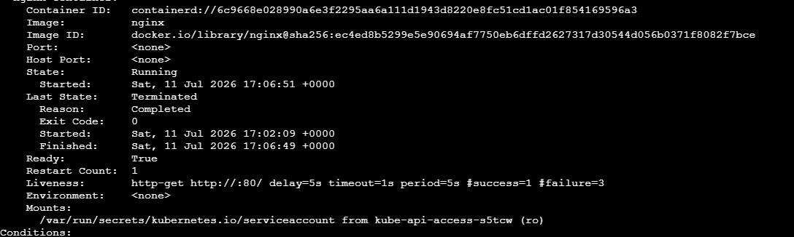

Capture:

```text
Last State: Terminated
Restart Count: 1
```

### Explanation

This confirms that Kubernetes detected an unhealthy application and restarted the container without manual intervention.

---

# Lab 2 – Readiness Probe

## What is a Readiness Probe?

A Readiness Probe determines whether a Pod is ready to receive traffic.

Unlike a liveness probe, readiness failures do not restart containers.

Instead, Kubernetes removes the Pod from Service endpoints until it becomes healthy again.

### Real-World Example

An Amazon checkout service may require 20–30 seconds to establish database connections. During that time, the application should not receive customer requests.

Readiness probes prevent traffic from reaching the Pod until it is fully initialized.

---

## Step 1: Deploy Resources

```bash
kubectl apply -f readiness.yaml

kubectl apply -f service.yaml
```

### Screenshot

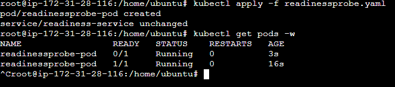

```bash
kubectl get pods
kubectl get svc
```

### Explanation

The Pod and Service are created. Initially, the Pod may not be marked Ready.

---

## Step 2: Watch Readiness Transition

```bash
kubectl get pods -w
```

### Screenshot

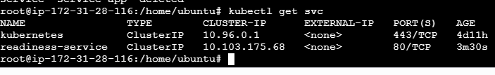

Capture:

```text
0/1 READY
```

followed by

```text
1/1 READY
```

### Explanation

The readiness probe succeeds after the application becomes available, allowing traffic to reach the Pod.

---

## Step 3: Simulate Readiness Failure

```bash
kubectl exec -it readiness-pod -- bash

rm -rf /usr/share/nginx/html/index.html

exit
```

### Screenshot

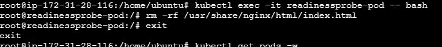

### Explanation

Removing the index page causes the readiness endpoint to fail.

---

## Step 4: Verify Pod Is Not Ready

```bash
kubectl get pods
```

### Screenshot

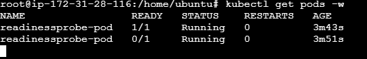

Expected:

```text
READY   0/1
STATUS  Running
```

### Explanation

The Pod is still running but is no longer considered ready for traffic.

---

## Step 5: Verify Endpoint Removal

```bash
kubectl get endpoints readiness-service
```

### Screenshot

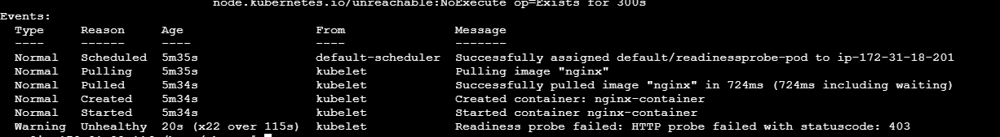

### Explanation

The Pod is removed from the Service endpoint list and no requests are routed to it.

---

## Step 6: Verify Probe Events

```bash
kubectl describe pod readiness-pod
```

### Screenshot

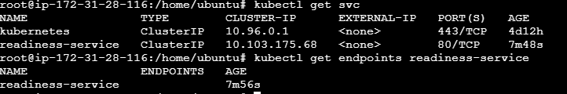

### Explanation

Events show readiness probe failures while the container continues running.

---

# Lab 3 – Startup Probe

## What is a Startup Probe?

A Startup Probe is designed for applications that require a long initialization period.

It disables liveness and readiness checks until startup completes successfully.

### Real-World Example

A Spring Boot application may require several minutes to perform database migrations and cache warm-up operations.

Without a startup probe, liveness checks might restart the application before startup completes.

---

## Step 1: Deploy the Pod

```bash
kubectl apply -f startup.yaml
```

### Screenshot

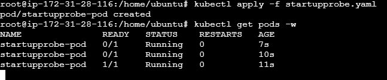

```bash
kubectl get pods
```

### Explanation

The Pod starts and Kubernetes begins monitoring the startup probe.

---

## Step 2: Verify Startup Probe Configuration

```bash
kubectl describe pod startup-pod
```

### Screenshot

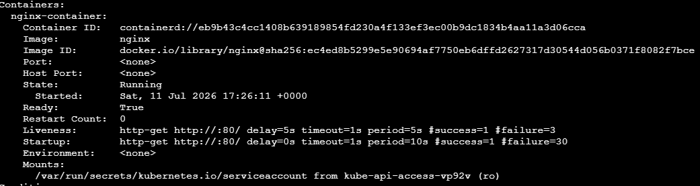

Capture:

```text
Startup Probe:
```

### Explanation

The startup probe defines how Kubernetes determines whether startup has completed.

---

## Step 3: Observe Startup Probe Activity

```bash
kubectl describe pod startup-pod
```

### Screenshot

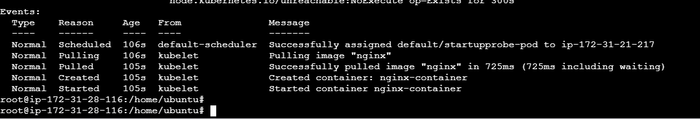

### Explanation

Events show startup probe execution before liveness and readiness probes become active.

---

## Step 4: Verify Liveness Activation

```bash
kubectl describe pod startup-pod
```


### Explanation

Once startup succeeds, Kubernetes activates liveness and readiness monitoring.

---

# Lab 4 – TCP Socket Probe

## What is a TCP Socket Probe?

TCP probes verify that a specific TCP port is accepting connections.

This is useful for applications such as MySQL, Redis, Kafka, and MongoDB that may not expose HTTP endpoints.

### Real-World Example

A Redis server may not provide an HTTP health endpoint. A TCP probe verifies that Redis is listening on port 6379.

---

## Step 1: Deploy Pod

```bash
kubectl apply -f tcp-probe.yaml
```

### Screenshot

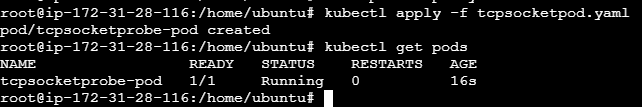

```bash
kubectl get pods
```

### Explanation

The Pod is created and Kubernetes begins TCP connectivity checks.

---

## Step 2: Verify TCP Probe Configuration

```bash
kubectl describe pod tcp-probe-pod
```

### Screenshot

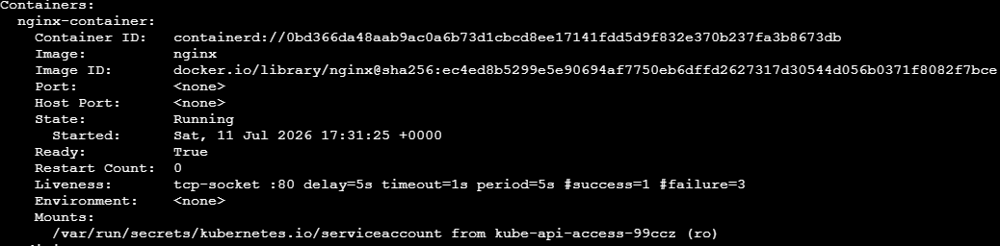

Capture:

```yaml
tcpSocket:
  port: 80
```

### Explanation

The kubelet attempts to establish a TCP connection to port 80.

---

## Step 3: Verify TCP Probe Success

```bash
kubectl describe pod tcp-probe-pod
```

### Screenshot

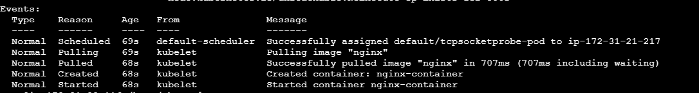

### Explanation

Successful probe events confirm that the port is accepting connections.

---

## Step 4: Verify Pod Status

```bash
kubectl get pod tcp-probe-pod -o wide
```

### Screenshot

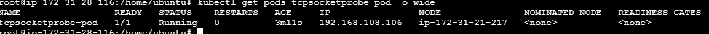

### Explanation

Displays Pod networking information and confirms the workload remains healthy.

---

# Lab 5 – Command (Exec) Probe

## What is an Exec Probe?

An Exec Probe executes a command inside the container.

If the command exits with status code 0, Kubernetes considers the container healthy.

Any non-zero exit code causes the probe to fail.

### Real-World Example

A LinkedIn ETL worker may update a heartbeat file every few seconds. An exec probe checks whether the file exists and is updated regularly.

---

## Step 1: Deploy Pod

```bash
kubectl apply -f command-probe.yaml
```

### Screenshot

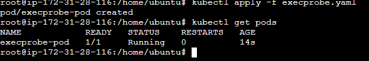

```bash
kubectl get pods
```

### Explanation

The Pod starts and creates the health-check file used by the probe.

---

## Step 2: Verify Exec Probe Configuration

```bash
kubectl describe pod command-probe
```

### Screenshot

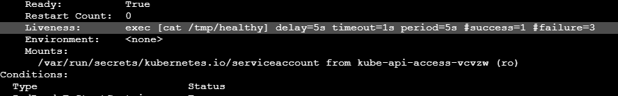

### Explanation

The probe executes a command that verifies the existence of the heartbeat file.

---

## Step 3: Simulate Probe Failure

```bash
kubectl exec -it command-probe -- sh

rm /tmp/healthy

exit
```

### Screenshot

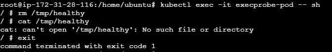

### Explanation

Removing the file causes subsequent probe executions to fail.

---

## Step 4: Observe Restart

```bash
kubectl get pods -w
```

### Screenshot

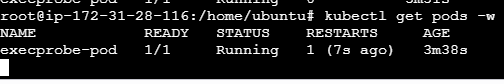

Expected:

```text
RESTARTS 1
```

### Explanation

The failed exec probe causes Kubernetes to restart the container.

---

## Step 5: Verify Restart Events

```bash
kubectl describe pod command-probe
```

### Screenshot

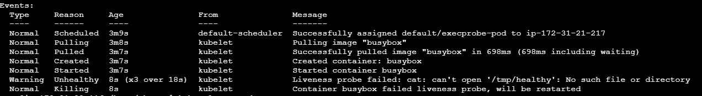

Capture:

```text
Last State: Terminated
Restart Count: 1
```

### Explanation

The container was automatically restarted after the probe detected a failure.

---

# Key Takeaways

* Liveness Probes restart unhealthy applications.
* Readiness Probes control traffic routing.
* Startup Probes protect slow-starting applications.
* TCP Probes validate network connectivity.
* Exec Probes support custom health-check logic.

Together, these probes help build highly available, self-healing Kubernetes workloads suitable for production environments.
