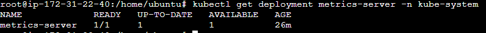
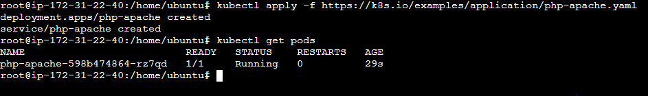
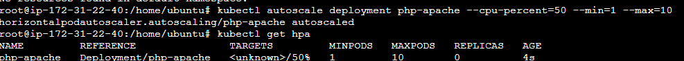
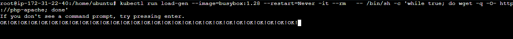
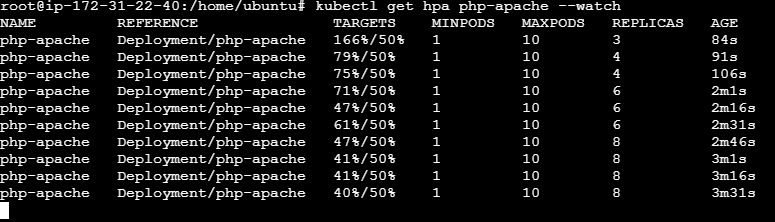
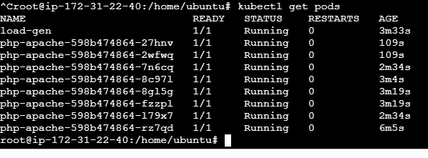

# Kubernetes Horizontal Pod Autoscaler (HPA) Lab

## Overview

Horizontal Pod Autoscaler (HPA) automatically scales the number of pod replicas based on observed CPU, memory, or custom metrics.

In this lab, we deploy a sample application, configure an HPA policy, generate load, and observe Kubernetes automatically increase pod replicas.

---

## Architecture

```text
User Requests
      │
      ▼
  PHP-Apache App
      │
      ▼
 Metrics Server
      │
      ▼
      HPA
      │
      ▼
 Scale Replicas
```

---

## Prerequisites

* Running Kubernetes Cluster (EKS)
* kubectl configured
* Metrics Server installed
* Minimum 2 worker nodes

Verify cluster:

```bash
kubectl get nodes
```

### Screenshot


---

## Step 1: Install Metrics Server

HPA requires Metrics Server to collect CPU and memory utilization metrics.

```bash
kubectl apply -f https://github.com/kubernetes-sigs/metrics-server/releases/latest/download/components.yaml
```

Patch Metrics Server for EKS:

```bash
kubectl patch deployment metrics-server -n kube-system \
--type='json' \
-p='[{"op":"add","path":"/spec/template/spec/containers/0/args/-","value":"--kubelet-insecure-tls"}]'
```

Verify deployment:

```bash
kubectl rollout status deployment metrics-server -n kube-system
kubectl get deployment metrics-server -n kube-system
```

Check metrics:

```bash
kubectl top nodes
```

### Screenshot




---

## Step 2: Deploy Sample Application

Deploy Kubernetes HPA demo application:

```bash
kubectl apply -f https://k8s.io/examples/application/php-apache.yaml
```

Verify deployment:

```bash
kubectl get deployment php-apache
kubectl get pods
```

Expected Output:

```text
php-apache-xxxxx Running
```

### Screenshot



---

## Step 3: Create Horizontal Pod Autoscaler

Configure HPA:

```bash
kubectl autoscale deployment php-apache \
--cpu-percent=50 \
--min=1 \
--max=10
```

Verify:

```bash
kubectl get hpa
```

Expected Output:

```text
NAME         REFERENCE                    TARGETS
php-apache   Deployment/php-apache        0%/50%
```

### Screenshot



---

## Step 4: Generate Load

Open a new terminal and run:

```bash
kubectl run load-generator \
--image=busybox:1.28 \
--restart=Never \
-it --rm \
-- /bin/sh -c "while true; do wget -q -O- http://php-apache; done"
```

This continuously sends requests to the application.

### Screenshot



---

## Step 5: Observe Auto Scaling

Monitor HPA:

```bash
kubectl get hpa php-apache --watch
```

Example:

```text
TARGETS     REPLICAS
0%/50%      1
245%/50%    5
80%/50%     7
48%/50%     7
```

### Screenshot



---

## Step 6: Verify Additional Pods

Check pods:

```bash
kubectl get pods
```

Expected:

```text
php-apache-xxxxx Running
php-apache-yyyyy Running
php-apache-zzzzz Running
...
```

### Screenshot



---

## Key Learning

* HPA scales applications horizontally.
* Metrics Server provides utilization metrics.
* HPA continuously evaluates CPU usage.
* New replicas are created when utilization exceeds threshold.
* Replicas are reduced when traffic decreases.

---

## Cleanup

```bash
kubectl delete deployment php-apache
kubectl delete service php-apache
kubectl delete hpa php-apache
```

---

## Commands Summary

```bash
kubectl apply -f https://k8s.io/examples/application/php-apache.yaml

kubectl autoscale deployment php-apache \
--cpu-percent=50 \
--min=1 \
--max=10

kubectl get hpa

kubectl get hpa php-apache --watch

kubectl get pods
```
