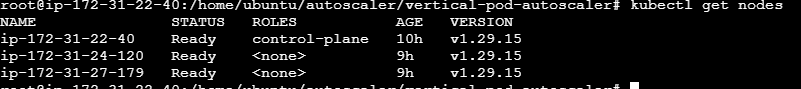
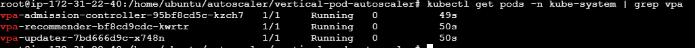
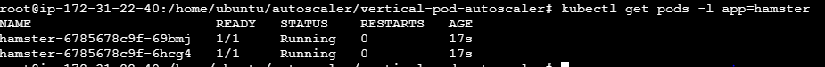
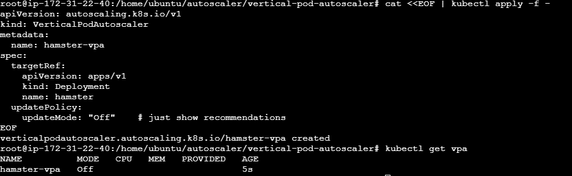
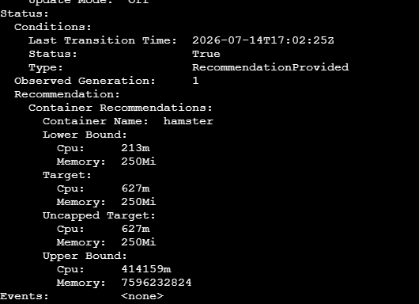
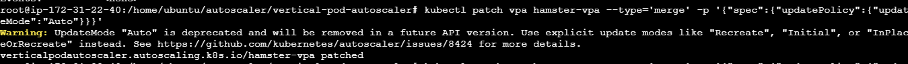
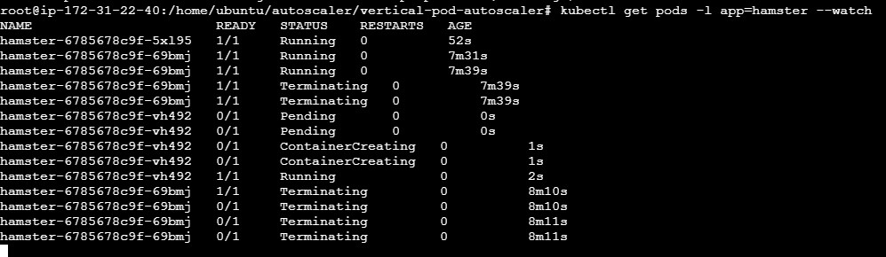
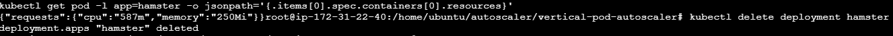

# Kubernetes Vertical Pod Autoscaler (VPA) Lab

## Overview

Vertical Pod Autoscaler (VPA) automatically recommends or adjusts CPU and memory requests for containers based on actual resource consumption.

Unlike HPA, which adds more pods, VPA increases or decreases resources assigned to existing pods.

---

## Architecture

```text
Application Pod
      │
      ▼
 VPA Recommender
      │
      ▼
 Resource Analysis
      │
      ▼
 Recommendation
      │
      ▼
 CPU / Memory Adjustment
```

---

## Prerequisites

* Running Kubernetes Cluster
* kubectl configured
* Metrics Server installed

Verify:

```bash
kubectl get nodes
```

### Screenshot



---

## Step 1: Install VPA Components

Clone autoscaler repository:

```bash
git clone https://github.com/kubernetes/autoscaler.git
```

Move to VPA directory:

```bash
cd autoscaler/vertical-pod-autoscaler
```

Install VPA:

```bash
./hack/vpa-up.sh
```

Verify:

```bash
kubectl get pods -n kube-system | grep vpa
```

Expected:

```text
vpa-admission-controller
vpa-recommender
vpa-updater
```

### Screenshot



---

## Step 2: Deploy Test Application

Create deployment:

```yaml
apiVersion: apps/v1
kind: Deployment
metadata:
  name: hamster
spec:
  replicas: 2
  selector:
    matchLabels:
      app: hamster
  template:
    metadata:
      labels:
        app: hamster
    spec:
      containers:
      - name: hamster
        image: ubuntu:22.04
        resources:
          requests:
            cpu: 100m
            memory: 50Mi
        command: ["/bin/sh"]
        args:
        - -c
        - while true; do timeout 0.5 yes >/dev/null; sleep 0.5; done
```

Apply:

```bash
kubectl apply -f hamster-deployment.yaml
```

Verify:

```bash
kubectl get pods -l app=hamster
```

### Screenshot



---

## Step 3: Create VPA Object

Create VPA configuration:

```yaml
apiVersion: autoscaling.k8s.io/v1
kind: VerticalPodAutoscaler
metadata:
  name: hamster-vpa
spec:
  targetRef:
    apiVersion: apps/v1
    kind: Deployment
    name: hamster
  updatePolicy:
    updateMode: Off
```

Apply:

```bash
kubectl apply -f hamster-vpa.yaml
```

Verify:

```bash
kubectl get vpa
```

### Screenshot



---

## Step 4: Analyze Recommendations

Wait 3–5 minutes.

Check recommendations:

```bash
kubectl describe vpa hamster-vpa
```

Example:

```text
Recommendation:
Container Recommendations:
Container Name: hamster

Lower Bound:
cpu: 200m

Target:
cpu: 580m

Upper Bound:
cpu: 1
```

### Screenshot



---

## Understanding Recommendations

| Recommendation | Meaning              |
| -------------- | -------------------- |
| Lower Bound    | Minimum safe value   |
| Target         | Recommended value    |
| Upper Bound    | Maximum useful value |

Example:

```text
Configured CPU = 100m
Recommended CPU = 580m
```

VPA determines that the application is under-provisioned and requires more CPU resources.

---

## Step 5: Enable Automatic Updates

Switch VPA mode:

```bash
kubectl patch vpa hamster-vpa \
--type='merge' \
-p '{"spec":{"updatePolicy":{"updateMode":"Auto"}}}'
```

Verify:

```bash
kubectl get vpa
```

### Screenshot



---

## Step 6: Watch Pod Restart

Monitor pods:

```bash
kubectl get pods -l app=hamster --watch
```

VPA restarts pods and applies new resource requests.

### Screenshot



---

## Verify Updated Resources

Check resources:

```bash
kubectl get pod -l app=hamster -o jsonpath='{.items[0].spec.containers[0].resources}'
```

Expected:

```text
cpu: 580m
memory: 50Mi
```

### Screenshot



---

## Key Learning

* VPA scales resources vertically.
* VPA continuously monitors actual resource usage.
* Recommendations help eliminate resource wastage.
* Auto mode updates workloads automatically.
* VPA is ideal for stateful and long-running applications.

---

## Cleanup

```bash
kubectl delete deployment hamster
kubectl delete vpa hamster-vpa
```

---

## Commands Summary

```bash
kubectl get pods -n kube-system | grep vpa

kubectl apply -f hamster-deployment.yaml

kubectl apply -f hamster-vpa.yaml

kubectl describe vpa hamster-vpa

kubectl patch vpa hamster-vpa \
--type='merge' \
-p '{"spec":{"updatePolicy":{"updateMode":"Auto"}}}'
```
